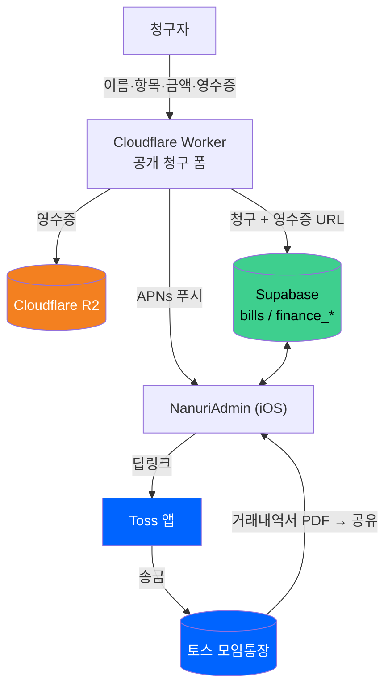
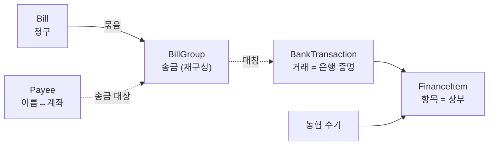
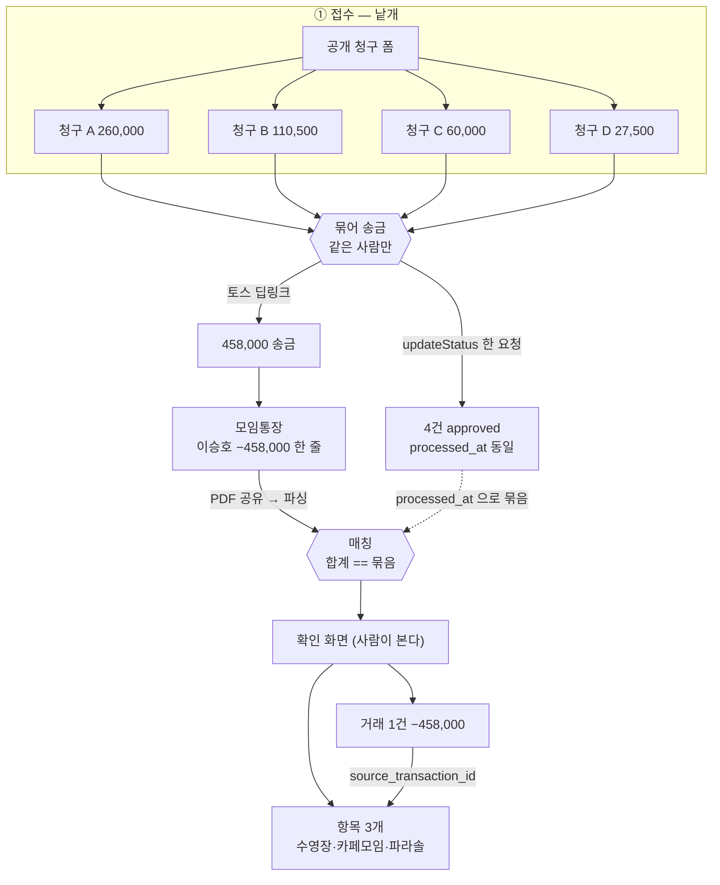

# 구조와 불변식

**코드를 고치기 전에 보는 문서다.** 여기 있는 건 "이렇게 돼 있다"가 아니라
**"이렇게 해야 하고, 안 그러면 이렇게 깨진다"** 이다.

프로젝트가 무엇인지는 [README.md](README.md), 설정값은 [SETUP.md](SETUP.md),
화면 규칙은 [DESIGN.md](DESIGN.md), 겪은 증상은 [TROUBLESHOOTING.md](TROUBLESHOOTING.md).

> **이 문서를 읽는 법.** 절마다 성격이 다르다.
> 🟢 **개요** — 처음 읽는 사람을 위한 지도. 세부는 없다. (§1~§4, §8)
> 🟡 **빠른 참조** — 규칙·짝·실패를 목록으로 훑고 상세 규칙을 가리킨다. (§5·§6·§10·§11)
> 🔵 **상세 규칙** — 규칙과 그 근거·실패가 한자리에 있는 몸통. (§7)
> ⚪ **변경 이력** — 지금은 안 쓰는 옛 설계. (§9)
>
> 무엇을 고치든 **§7 의 해당 규칙 → §6 함께 변경 → 관련 Feature README** 순으로 본다.

---

# 1. 요약  🟢

나누리 회계는 **청구 → 송금 → 은행 거래내역 대조 → 장부 반영**을 지원하는
관리자 1인용 iOS 앱이다.

핵심 구조:
- 청구는 Worker 를 거쳐 Supabase(`bills`)에 저장된다.
- 관리자는 Toss 딥링크로 송금한다.
- 은행 거래내역은 거래(`finance_transactions`)로 **보존**한다 — 편집하지 않는다.
- 실제 장부는 항목(`finance_items`)이 표현한다 — 잔액·보고서·목록이 여기서 나온다.
- 농협 수기 입력은 거래 없이 항목으로만 들어온다(`source_transaction_id` 비어 있음).

코드를 수정하기 전에:
1. 관련 Feature README
2. 이 문서의 해당 상세 규칙 (§7A 재정 / §7B 플랫폼)
3. §6 함께 변경해야 하는 항목

을 확인한다.

---

# 2. 전체 구조  🟢

세 영역이 한 시스템이다 — 청구를 받는 **Worker**, 저장하는 **Supabase**,
관리자가 쓰는 **iOS 앱**. 실제 송금은 **Toss** 가, 영수증은 **R2** 가 맡는다.



도메인 관계 — 청구가 송금으로 묶이고, 통장 거래 한 줄이 장부 여러 항목으로 풀린다.
**농협 수기 항목은 거래 없이 홀로 선다.**



---

# 3. 핵심 도메인  🟢

| 도메인 | 앱 타입 | 저장 | 뜻 |
| --- | --- | --- | --- |
| **청구** | `Bill` | `bills` | 청구자가 제출한 청구 1건 |
| **송금 묶음** | `BillGroup` | **저장 안 함** | 같은 사람의 청구를 합친 송금 1건. `processed_at`+이름으로 재구성(`StatementMatcher.groups(from:)`) |
| **거래** | `BankTransaction` | `finance_transactions` | 은행이 증명한 사실. 토스 내역서 한 줄. 편집 안 함 |
| **항목** | `FinanceItem` | `finance_items` | 사람이 관리하는 장부 정본. 카테고리·적요·영수증·분할 |
| **수취인** | `Payee` | `payees` | 청구자 이름 ↔ 실제 송금 계좌 |

두 축이 핵심이다.

- **청구(`Bill`) → 송금(`BillGroup`).** 같은 사람의 여러 청구를 금액 합쳐 한 번에
  보낸다. `BillGroup` 은 표가 아니라 `processed_at`(트리거가 `now()`)로 그때그때 묶는다.
- **거래(`BankTransaction`) → 항목(`FinanceItem`).** 거래는 은행 증명이라 편집 안 하고,
  항목은 사람의 판단이다. 한 거래가 여러 항목으로 풀린다. 편집 가능 범위는
  `source_transaction_id` 의 유무가 정한다 (§7A).

---

# 4. 데이터 흐름  🟢

단계마다 데이터 단위가 다르다 — **청구 4 → 송금 1 → 거래 1 → 항목 3.** 낱개로 받아
송금으로 묶고, 통장에 한 줄로 찍힌 것을 장부로 되푼다.



청구 데이터는 공개 웹 폼으로 들어온다 — **이름·항목·금액·영수증** 네 가지뿐이고
계좌는 받지 않는다(§7A). 청구를 안 지나는 줄(이자·ATM·회비·내부 이체)은 확인 화면에서
사람이 적요를 적는다. 세부 규칙(금액 1차 키·시각 창·시간대·중복 방지·내부 이체 판정)은
§7A 에 있다.

---

# 5. 불변식  🟡

**반드시 참이어야 하는 것.** 규칙마다 근거는 §7 에 있다 — 여기서는 목록만.

- **같은 수취인의 청구만 묶는다.** 딥링크는 수취인 한 명·금액 하나. → §7A
- **금액이 1차 매칭 키.** 시각은 후보 창(`matchWindow`)+순위, 이름은 보조. → §7A
- **Date 에 시간대 변환 금지.** `processedAt`·`datetime` 은 절대 시각. → §7A
- **거래는 은행 증명 — 금액·일시·통장 편집 금지.** 항목만 사람이 고친다. → §7A
- **모든 거래는 최소 한 항목으로 완전히 풀린다.** Σ항목 = 거래 금액. → §7A
- **편집 가능 범위는 `source_transaction_id` 유무가 정한다 (뷰모델에서).** → §7A
- **내부 이체는 한 항목.** 잔액엔 반영, 합계·보고서엔 `filteredExternal` 로 제외. → §7A
- **잔액은 저장하지 않고 유도한다.** 개시잔액 + 통장을 지나간 amount 합. → §7A
- **장부는 월별.** 임의 기간 없음. → §7A
- **`bills` INSERT 정책 없음.** 워커 `service_role` 만. → §7B
- **새 `public` 테이블은 RLS 필수, 모든 정책은 `is_admin()` 기준.** → §7B

---

# 6. 함께 변경해야 하는 항목  🟡

**한쪽만 바꾸면 조용히 깨지는 것들이다.**

| 짝 | 위치 |
| --- | --- |
| **이름 정규화** | DB `payees_name_normalized_idx` (`lower(regexp_replace(name,'\s','','g'))`) ↔ 앱 `String.normalizedName` |
| **저장 전 공백 통일** | 워커의 `submitterName` 처리 ↔ 앱 `String.whitespaceNormalized` |
| **은행 목록** | `Features/Profile/Profile.swift` 의 `koreanBanks` ↔ `TossDeepLink` 가 이 문자열을 딥링크의 `bank` 값으로 그대로 넘긴다 |
| **워커 주소** | `Components/ReceiptStorage.swift` ↔ 계정 서브도메인 |
| **R2 공개 도메인** | `worker/wrangler.toml` 의 `R2_PUBLIC_URL` ↔ 이미 저장된 영수증 URL |
| **영수증 라우트 인증** | 워커 `requireAdmin()` ↔ 앱 `ReceiptStorage.accessToken()` |
| **APNs 환경** | 워커의 `device_tokens.environment` ↔ 앱의 `#if DEBUG` |
| **통장 이름** | DB `finance_accounts.name` (`'농협'`·`'모임'`) ↔ 앱 `account(named:)` 의 문자열 |
| **항목 컬럼 이름** | DB `finance_items` 의 컬럼 ↔ 앱 `FinanceItem`·`FinanceItemInsert` 의 `CodingKeys` |
| **은행 증명 표식** | DB `finance_items.source_transaction_id` 의 유무 ↔ 앱 `FinanceItem.isBankBacked` (편집 잠금의 근거) |
| **통장의 예금주 이름** | DB `finance_accounts.holder_name` (`'예수교대한성결고천교'`) ↔ 토스 내역서 적요에 실제로 찍히는 문자열 |

맨 앞의 둘은 **한 세트**다. PG 의 `\s` 는 U+00A0 을 공백으로 안 보기 때문에
저장 전에 미리 통일해야 인덱스와 앱의 판단이 일치한다.

`R2_PUBLIC_URL` 은 삭제할 때 URL 앞부분을 떼어 키를 얻는 데 쓴다. 바꾸면 **새로
올리는 건 되는데 옛 영수증만 안 지워진다** — 반쪽만 깨져서 알아채기 어렵다.

APNs 환경이 어긋나면 `BadDeviceToken` 이 나고 **화면에는 아무것도 안 뜬다.**
Release 구성을 development 프로파일로 기기에 올릴 때 그렇게 된다.

항목 컬럼과 앱 `CodingKeys` 가 어긋나면 **장부 저장이 통째로 실패한다** — 읽기는
조용히 `nil` 이 되고 쓰기는 없는 열에 넣으려다 죽는다. `source_transaction_id` 는
값이 아니라 **유무**가 뜻이다 — 있으면 은행 증명이 뒤에 있는 항목(모임), 없으면
농협 수기. 앱의 편집 잠금(`isBankBacked`)이 이 유무 하나에 걸려 있다.

---

# 7. 상세 규칙  🔵

**이 문서의 몸통이다.** 각 규칙에 왜 그런지·안 지키면 무엇이 깨지는지를 함께 둔다.

## 7A. 재정 (Finance)

### 청구를 묶어 보낸다 — 같은 사람만

같은 사람의 대기중 청구서는 묶어서 한 번에 보낸다. 청구서 탭 헤더 왼쪽의 선택
모드에서 고르면 금액을 합쳐 토스를 한 번만 연다.

**토스 딥링크(`supertoss://send`)가 수취인 한 명·금액 하나라 사람이 다르면 못 묶는다.**
승인은 `updateStatus(billIds:)` 로 **한 요청에** 처리한다 — 나눠 보내면 중간에
끊길 때 일부만 완료로 남아 나머지가 다시 청구된 것처럼 보인다.

- 청구 폼이 받는 값은 **이름·항목·금액·영수증** 네 가지뿐이다. 계좌는 받지 않는다.
  폼에서 받으면 청구자가 매번 계좌번호를 적어야 하고 **한 자리만 틀려도 엉뚱한 곳으로
  돈이 나간다.** 청구하는 사람이 많지 않아, 계좌는 받을 값이 아니라 관리자가 갖고
  있을 값으로 봤다.
- 계좌는 관리자가 앱의 **계좌부 탭(`payees`)** 에 이름↔계좌로 등록해 둔다.
  계좌부에 없는 이름이면 청구서 목록에 "계좌 미등록"으로 뜨고, 누르면 그 이름이
  채워진 등록 시트가 바로 열린다 (목록을 거치지 않는다).

### 통장은 둘, 장부는 하나

- **교회법인 농협통장** — 총액을 보관한다. **헌금이 여기로 들어온다** (모임통장은
  헌금 수령처로 승인나지 않았다).
- **토스 모임통장** — 청구를 실시간으로 처리한다. 매달 농협에서 예산을 넘겨 두고
  지출은 여기서 난다. 연합 행사용 통장이 곧 이 통장이라 후원금도 여기로 온다.

**두 통장의 거래내역을 둘 다 보고 하나의 장부에 적는다.** 통장이 둘인데 장부가
하나라는 게 이 구조의 전부다.

**모임통장 잔액은 결산 때 농협으로 돌려보낸다** (2026-09-03 확인). 예전에는 이
문서가 "매달 0으로 떨어진다" 고 적어 두고 그걸 검산으로 삼았는데, **실제 운영은
매달이 아니다** — 2026-08 말 모임통장에 1,035,544원이 남아 있었고 9월에도 반환
줄이 없다.

그래서 **매달 도는 검산은 이제 `잔액 반환` 이 아니라 토스 대조다.** 거래내역서의
`거래 후 잔액` 은 은행이 계산한 값이라, 앱이 유도한 모임통장 잔액과 맞춰 보면 된다
(`ParsedStatementLine.balance` 가 그 값을 이미 들고 있다). 결산 때의 0원은 여전히
검산이지만 **1년에 몇 번뿐이라 매달의 기준이 못 된다.**

**농협 쪽에는 그런 외부 기준이 없다.** 인터넷뱅킹이 없어 내역서가 안 나오므로,
사람이 농협 앱에서 잔액을 보고 앱과 견주는 수밖에 없다.

### 두 층: 거래는 은행 증명, 항목은 장부

재정은 두 표로 갈린다.

- **거래(`finance_transactions`)** — 은행이 증명한 사실. 토스 거래내역서 한 줄이
  곧 한 행이다. **파싱으로만 생기고 절대 편집하지 않는다.** 금액·일시·통장은
  통장의 기록이다. 실질적으로 모임통장만 여기 담긴다.
- **항목(`finance_items`)** — 장부 정본, 사람의 판단. **잔액·보고서·목록이 전부
  여기서 나온다.** 카테고리·적요·영수증·분할이 사는 곳이다.

항목의 `source_transaction_id` 가 신뢰수준을 가른다 — 차 있으면 은행 증명이 뒤에
있는 항목(모임), 비어 있으면 **농협 수기**(뒤에 거래가 없다). 농협은 인터넷뱅킹이
없어 증명할 은행 줄이 아예 없고, 그 사실이 이 칸이 비어 있는 것으로 정직하게 드러난다.

**대조는 은행 증명이 있는 항목에만 있다** — 한 거래에서 나온 항목들의 금액 합이 그
거래의 금액과 같아야 한다(`Σ finance_items.amount where source_transaction_id=T ==
finance_transactions.amount`). 농협은 대조할 거래가 없어 그 검산이 없다.

**모든 거래는 최소 한 항목으로 완전히 풀린다.** 청구가 맞으면 청구별 항목, 아무
청구도 없으면 통짜 항목 하나, 내부 이체면 이체 항목 하나다. 안 그러면 은행이 말한
총액(거래)과 장부(항목)가 벌어진다.

> 예전에는 농협 수기를 `finance_transactions.source = 'manual'` 로 같은 거래 표에
> 넣었다. 은행이 증명하지 않은 값을 은행 기록 표에 **은행 기록인 척** 넣는 위장이라,
> 2026-09-05 에 걷어냈다. 농협 수기는 이제 거래가 아니라 항목이다.

### 내부 이체는 한 항목이고, 그 항목이 이체임을 안다

농협에서 모임으로 돈을 옮기는 건 **한 사건인데 통장 둘에 걸친다.**
`finance_items.is_internal_transfer` 가 그 항목이 이체임을 표시한다.

| | `account_id` | `amount` | `is_internal_transfer` |
| --- | --- | --- | --- |
| 헌금 입금 | 농협 | +500,000 | `false` |
| 예산 수령 | 모임 | +4,000,000 | `true` |
| 청구 지출 | 모임 | −85,000 | `false` |
| 잔액 반환 | 모임 | −312,000 | `true` |

**끄면 실제 수입·지출, 켜면 내부 이체다.** 두 줄(농협 출금 + 모임 입금)로 적지 않는
이유는 그 둘이 같은 사건이라는 걸 따로 짝지어야 하고 **짝이 깨지면 조용히 틀어지기**
때문이다.

상대 통장은 따로 안 적는다 — **통장이 둘로 고정이라 상대는 늘 '다른 통장 하나'다.**
(셋이 되면 상대를 지목해야 해 bool 로는 모자라지만, 이 도메인엔 그 시나리오가 없다.)

이 한 칸이 세 가지를 한다.

1. **통장별 잔액 유도** — 항목이 적힌 통장은 부호 그대로, **다른 통장은 부호를
   뒤집어** 더한다 (`FinanceViewModel.balance(of:)`). 총 재정은 상쇄돼 저절로 맞는다.
2. **합계·보고서·그래프에서 자동 제외** — 안 빼면 그 달이 부풀어 보인다.
   2026-08 이 실제로 그랬다: 장부상 지출 4,974,200 중 4,000,000 이 내부 이체라
   진짜 지출(974,200)의 **5.1배**로 보였다.
3. `예산 수령`·`잔액 반환` 은 **형태에서 파생되는 이름**이라 사람이 안 고른다.

**뷰모델에서 `filtered` 와 `filteredExternal` 을 구별한다.** 목록은 `filtered`(전부)
— 400만원을 옮긴 사실이 화면에서 사라지면 그게 더 이상하다. 합계·보고서·그래프는
전부 `filteredExternal`(내부 이체 제외)이다. **새 집계를 추가할 때 어느 쪽인지
반드시 정해야 한다.**

예외가 하나 있다 — `internalTransferFlows` 는 **일부러 내부 이체만** 센다
(`filteredExternal` 의 여집합). 통장 화면이 "왜 통장 잔액은 움직였는데 총 출금은
그대로인가" 를 설명할 때만 쓴다.

### 사람의 장부에는 이 줄이 없다 — 그래도 DB 에는 남긴다

**사람이 쓰는 엑셀 장부에는 내부 이체 줄이 아예 없다.** 두 통장을 한 지갑으로 보고
주머니를 옮긴 건 적지 않는다. 2026-08 시트에서 `모임통장 운영비 4,000,000` 줄이
빠지고 그 돈으로 실제 쓴 내역이 그 자리에 들어온 게 그것이다.

**그래도 DB 에는 남긴다** (2026-09-03 결정). 출력물은 어느 쪽이든 같다 — 보고서가
`filteredExternal` 을 쓰므로 그 줄은 어차피 안 나온다. 갈리는 건 **검증할 수 있느냐**다.

- 안 남기면 **통장별 잔액을 못 만든다.** 400만원이 농협에서 빠져 모임으로 들어간
  사실이 어디에도 없으니 두 잔액 다 틀어진다.
- 그러면 **토스 내역 대조**도 **결산 때의 0원 검산**도 불가능해진다. 잔액을 유도로 바꾼
  뒤로 유도값은 늘 스스로 맞기 때문에, 바깥에서 틀렸다고 말해 줄 기준이 이 둘뿐이다.

그래서 **"장부에 없는 줄이 왜 데이터에 있지" 하고 지우면 안 된다.** 보이는 곳과
쓰이는 곳이 다를 뿐이다 — 목록과 통장 화면에는 나오고, 보고서와 합계에는 안 나온다.

### 거래내역서는 청구서와 맞춰서 들어온다

토스 거래내역서 한 줄이 **청구 N건**과 맞는다. 맞으면 적요와 분할이 저절로 채워진다.
흐름도는 §4.

**완전한 역연산이 아니다.** 4건이 3항목으로 돌아온다 — `itemSpecs`(속 `ledgerLines`)
가 같은 제목을 합치기 때문이다(카페모임 110,500 + 27,500 = 138,000). **영수증도
항목별로** 실린다 — 카페모임 항목은 두 청구의 영수증 두 장을 갖는다. 사람이 손으로
그렇게 적었고, 원본 4건은 `bills` 에 그대로 남아 있어 잃는 것이 없다.

청구를 안 지나는 줄도 섞여 온다 — ATM출금·이자·회비 입금·내부 이체는 청구를 안
지난다. 그 줄들은 "후보 없음" 으로 떨어지고 확인 화면에서 사람이 적요를 적는다.

**되는 이유는 `processed_at` 이다.** 묶어 보내기가 `updateStatus(billIds:)` 로 한
요청에 승인하고 트리거가 `now()` 를 찍으므로, 같이 승인된 청구들의 `processed_at`
이 **한 마이크로초까지 같다.** 그 묶음의 합계가 곧 토스에서 빠진 금액이다.

#### 금액이 1차 키다. 시각은 순위용 + 창(window), 이름은 순위용이다

- 송금 건은 승인이 **8~38초** 뒤라 시각이 잘 맞는다.
- **체크카드결제는 26~27시간까지 벌어진다** — 현장에서 긁고 승인은 나중에 한다.
  게다가 토스 적요가 예금주가 아니라 **가맹점 이름**(`우성볼링장`·`도래샘`)이라
  이름 대조도 안 된다. 그래도 금액으로 정확히 맞았다.

2026-08 실데이터로 확인했다 — 내역서 22줄 중 **13줄 자동 매칭, 애매한 것 0.**
나머지 9줄은 애초에 청구가 없다 (이자 · 내부 이체 · ATM 출금 3 · 회비 입금 4).

**후보가 하나뿐이고 그 묶음이 다른 줄에는 안 걸릴 때만** 미리 고른다. 금액이 겹치면
사람이 고른다 — 회비 17,000 처럼 같은 금액이 여럿일 수 있다.

**시각은 순위뿐 아니라 "가능 후보"를 거르는 창으로도 쓴다** (`matchWindow`, 2일).
청구는 송금이라 승인 직후 통장에 찍히므로, 금액만 우연히 같고 **몇 주씩 떨어진**
청구는 후보가 아니다. 안 그러면 8/20 현금 5만 인출이 9/5 결혼축의금 5만에 붙는다
([TROUBLESHOOTING.md](TROUBLESHOOTING.md) 2026-09-08). 체크카드(27h)엔 청구가 없어
창이 좁아도 놓치는 게 없다.

#### ⚠️ 시각에 시간대 변환을 넣지 말 것

`Bill.processedAt` 도 `ParsedStatementLine.datetime` 도 **절대 시각(`Date`)** 이라
그대로 빼면 된다. 대시보드에서 `to_char` 로 찍어 보면 UTC 라 9시간 어긋나 보이는데,
그건 **보는 방식의 문제**지 값의 문제가 아니다. 여기에 9시간을 더하면 전부 틀어진다.

### 넣기 전에 사람이 본다

`StatementImportView` 가 확인 화면이다. 예전에는 불러오기를 누르면 곧바로 저장했는데,
그때는 앱이 통장을 베끼는 게 전부라 확인할 것이 없었다. 지금은 **기계가 지어낸
이름이 장부에 들어가므로** 한 번 보여준다.

거래(은행 증명)는 **통장에 찍힌 그대로** 넣고, 장부에 적힐 것은 **항목**으로 만든다.
아무 청구도 없는 줄(이자·ATM출금)도 통짜 항목 하나로 푼다 — **모든 거래는 최소 한
항목으로 완전히 풀려야** 은행 총액과 장부가 대조된다. **같은 제목의 청구는 한 항목으로
합치고, 그 항목이 두 청구의 영수증을 다 갖는다** (이승호 청구 4건 → 항목 3개).

**같은 내역서를 두 번 넣어도 중복이 안 생긴다.** 같은 시각·같은 금액이 이미 있으면
건너뛴다. 예전에는 `unique (ledger_id, datetime, amount)` 가 DB 에서 막았는데 그
제약이 수기 입력을 방해해서 걷어냈고, 그 일을 **불러오기 경로에서만** 대신한다.

### 통장 사이 이체는 거래내역서로 들어온다 — 손으로 안 적는다

**농협↔모임 이체는 반드시 모임통장을 지나므로 토스 내역서에 찍힌다.** 예산 수령은
`ATM입금 … 예수교대한성결고천교`, 월말 잔액 반환은 `출금 … 예수교대한성결고천교` 다.
토스가 상대 예금주 이름을 적요에 넣기 때문이다.

그래서 **농협 수기 입력에서 내부 이체를 적을 필요가 없다.** 손으로 적으면 오히려
같은 사건이 두 줄이 된다. 농협 수기 입력은 헌금·심방비 같은 진짜 수입·지출만 맡는다.
(`AddTransactionView` 에는 토글이 없다 — 수기 추가는 이체를 만들 일이 없다. 매처가
못 잡은 것은 불러오기 확인 화면에서 바로잡는다.)

판정은 **적요가 다른 통장의 `holder_name` 과 같은가** 하나다. 그 이름은
`finance_accounts.holder_name` 에 있다 — `name`('농협'·'모임')은 사람이 부르는
별명이라 이 자리에 못 쓴다.

내부 이체로 잡힌 줄은 **청구 후보를 아예 만들지 않는다.** 금액이 우연히 청구 묶음과
같을 수 있어서다. 저장할 때는 이체 항목 하나(`is_internal_transfer=true`)만 만든다 —
청구별로 쪼개지 않는다.

**불러오기 확인 화면에서 사람이 끌 수 있다.** 이름이 우연히 같아 오탐이 날 수 있고,
잠가 두면 빠져나갈 길이 없다. (넣은 뒤에 다시 뒤집는 자리는 분할 편집 UX 와 함께
붙일 예정이다. 수기 거래엔 토글이 없다 — 이체는 내역서로만 들어오니까.)

안 잡으면 그 줄이 평범한 입금으로 들어가서 **농협 잔액이 그만큼 많고, 총 재정과
총 입금이 부풀며, 토스 대조가 어긋난다.** 보고서에는 원래 안 나오므로
(`filteredExternal`) **출력물만 봐서는 안 드러난다.**

### 확인 화면에서 적요와 카테고리를 적는다

청구가 없는 줄(`우성볼링장`·`ATM현금`·`통장 이자`)은 은행 적요밖에 없다. 예전에는
그대로 넣은 뒤 거래를 하나씩 열어 분할을 만들어야 했다 — **같은 일을 두 번 하는
자리였다.** 지금은 확인 화면에서 항목마다 적요와 카테고리를 적는다.

적으면 **항목 하나**가 그 적요를 갖는다. 거래의 은행 적요(`finance_transactions.
description`)는 그대로 살아 있다 — 나중에 통장과 대조할 때 은행이 뭐라고 찍었는지가
필요하다.

**청구를 골랐으면 적요 칸을 안 준다.** 적요가 청구 제목에서 오는데 적는 자리까지
있으면 어느 것이 맞는지가 매번 흔들린다. 카테고리는 청구에 없는 값이라 늘 열려 있고,
그 줄에서 나온 **모든 항목에 같이** 붙는다.

무엇이 항목이 되는지는 `StatementMatch.itemSpecs` 한 곳이 정한다 — 청구 묶음의
제목들이거나, 사람이 적은 적요 한 줄이거나, 내부 이체 한 줄이거나, 아무것도 없으면
통짜 한 줄이다. 미리보기(`ledgerLines`)와 저장(`itemSpecs`)이 같은 계산에서 나와
**화면이 보여준 것과 저장되는 것이 어긋날 수 없다.**

### 파일은 보관하지 않는다 — 공유하면 확인 화면이 바로 뜬다

`공유 → 확인 화면` 이 전부다. 중간에 목록도 고르기도 없다. 왜 대기실이 없어졌는지는
§9 에 있다.

그리고 **원본은 파일 앱에 그대로 있다.** 앱이 복사해 두는 건 사본을 하나 더
만드는 것이고, 통장 거래 전체가 앱 컨테이너에 쌓여 백업까지 올라간다.

**확인 화면을 닫으면 그 파일은 사라진다.** 그래서 넣을 게 남아 있으면 닫을 때
한 번 묻고, 쓸어내려 닫는 것은 막는다 — 물어볼 자리를 남기려는 것이다. 다
이미 장부에 있는 내역서라면 잃을 게 없으니 안 묻는다.

### 파일은 토스 앱에서 기기로 바로 나온다 — 메일도 서버도 안 거친다

토스 앱 `거래내역서 > PDF > PDF로 저장하기` 가 파일을 **기기에 바로 준다.**
그걸 iOS 공유 시트로 이 앱에 넘기면 `onOpenURL` 이 받는다(루트에서, §7B). **그 파일은
잠겨 있지 않다** (2026-09-03 확인) — 비밀번호는 메일로 보낼 때 붙는 것이라, 남의
메일함을 안 거치는 이 경로에는 없다.

그래서 **Gmail API 도 별도 백엔드도 만들지 않는다.** 2026-09-03 에 한 번 검토했고
접었다 — 자세한 논거는 §9. 요지는 `PDF로 저장하기` 가 있어 메일을 거칠 이유가 없고,
파일이 안 잠겨 있어 복호화가 필요 없다는 것이다.

### 장부는 앱에서 쓰고 고친다 — 무엇을 고칠 수 있는지는 출처가 정한다

앱이 장부의 주인이 된 뒤로 거래를 **추가·수정·삭제**할 수 있어야 한다. 한동안
카테고리·메모·영수증·분할만 고칠 수 있었는데, 그건 **통장 PDF 가 진실이던 시절의 구조**다
— 거래가 은행에서 오는 것이라 앱이 고칠 이유가 없었다.

**무엇을 고쳐도 되는지는 `finance_items.source_transaction_id` 의 유무가 정한다.**

| | 적요·카테고리·영수증 | 금액·일시·통장 |
| --- | --- | --- |
| 은행 증명 있음 (모임, `source_transaction_id` 참) | 고칠 수 있다 | **잠근다** |
| 농협 수기 (`source_transaction_id` 비어 있음) | 고칠 수 있다 | 고칠 수 있다 |

금액·일시·통장을 잠그는 이유는 그 셋이 **통장의 기록**이기 때문이다. 은행 증명이 있는
항목은 그 값이 거래(`finance_transactions`)에서 오고, 고치면 통장과 어긋나 대조가 뜻을
잃는다. **적요·카테고리·영수증은 둘 다 열려 있다** — 통장이 주는 적요는 예금주·가맹점
이름(`홍길동`·`우성볼링장`·`ATM현금`)이라 장부에 그대로 적을 수 없고, 장부에 적히는 건
"아침식사"·"볼링 게임 16명" 같은 **뜻**이다.

**잠그는 판단은 화면이 아니라 뷰모델이 한다.** 화면이 chevron 을 안 다는 건 안내일
뿐이고, 규칙이 화면에만 있으면 화면이 하나 더 생길 때 조용히 새어 나간다. 편집은 두
갈래로 수렴한다 — 농협 수기는 `saveManualItem`(전 필드), 은행 증명 있는 항목은
`saveItemFields`(사람 값만). 후자는 애초에 금액·일시·통장을 페이로드에 안 담는다.

편집 화면은 `ItemEditView` 하나다 — 항목이 곧 장부 줄이라 거래·조각을 가르지 않는다.
`isBankBacked`(`source_transaction_id != nil`)를 보고 금액·일시·통장에 chevron 을 달지
말지를 정한다.

**내부 이체 토글과 분할 재편집(한 항목을 여럿으로 다시 쪼개기)은 아직 이 화면에 없다.**
불러올 때 매처가 세운 이체·분할이 그대로 유지되고, 사후 편집은 분할 UX 와 함께 붙일
예정이다. 2026-09-03 에 실제로 필요했던 사후 이체 교정(8월 예산 수령 줄)은 지금은
불러오기 확인 화면에서 미리 잡는 것으로 대신한다.

#### 손으로 넣는 화면은 연달아 넣기가 빨라야 한다

`AddTransactionView` 는 **저장해도 닫히지 않는다.** 농협은 인터넷뱅킹이 없어
거래내역 파일이 안 나오므로 한 달에 25건 안팎을 손으로 옮겨 적는다. 한 건마다
시트를 다시 여는 건 25번 반복할 동작이 아니다.

저장하면 **금액과 적요만 비우고** 일시·통장·종류·카테고리는 남긴다 (장부는 같은 날 여러
건이 몰린다 — 2026-08-05 에 7건). 금액에 포커스가 돌아오고, 넣은 건수를 제목에 센다.

넣은 뒤 목록을 다시 받지 않고 **돌려받은 행을 그 자리에 꽂는다.** 한 건마다 273건을
다시 받으면 입력이 끊긴다.

#### 목록은 항목 단위다

재정 목록이 그리는 것은 **`LedgerRow`** 다 — **항목 하나가 한 줄이다.** 은행 증명이
있으면 그 거래를 맥락으로 함께 들고 온다(상세 화면이 은행 적요·"속한 출금"을
보여준다). 묶어 보낸 출금 하나가 항목 아홉이면 아홉 줄이다.

예전에는 거래를 그렸고, 그래서 **목록만 통장 시점이고 보고서·분석은 장부 시점**
이라 한 앱 안에 단위가 둘이었다. 이제 항목이 장부 정본이라 셋이 한 단위다. 사람이
쓰던 엑셀도 항목 단위다.

**통장 대조를 잃지 않는다.** 중복 방지(`StatementMatcher`)도 잔액 검산도
**데이터가 하는 일**이라 화면이 어떻게 그려지든 그대로고, 통장을 나란히 놓고 보는
자리는 거래내역서 확인 화면이 맡는다.

**내부 이체는 항목 하나다.** 청구별로 안 쪼갠다 — 사람 장부에 없는 줄이라 목록엔 한 줄로 남는다.

#### 카테고리는 목록에서 여러 항목에 한 번에 붙인다

`applyCategory(_:to:)` 가 **건별로 나눠 보내지 않는다.** 조각은 조각끼리, 거래는
거래끼리 한 요청씩 두 번이다 — 나눠 보내면 중간에 끊겼을 때 일부만 붙은 채로 남는다.
`updateStatus(billIds:)` 와 같은 이유다.

붙인 뒤 목록을 다시 받지 않고 **그 자리에 꽂는다.** 스무 항목에 붙이고 나서 화면이
통째로 다시 그려지면 어디를 보고 있었는지를 잃는다.

### 잔액은 저장하지 않고 유도한다

`finance_transactions.balance` 는 **없앴다** (2026-09-02). 통장 단위 잔액이라
**두 통장을 한 장부에 적는 순간 어느 통장의 잔액도 아니게 됐다** — 농협 거래 다음
항목에 모임 거래가 오면 그 항목의 잔액은 아무것도 아니다.

지금은 `finance_accounts.opening_balance` 에서 출발해 누적한다.

```
통장 잔액 = 개시잔액 + Σ{그 통장을 지나간 amount}
전월이월  = Σ개시잔액 + Σ{그 달 이전의 실제 수입·지출}   ← 내부 이체는 빼고
```

**이 값을 읽는 화면은 `AccountBalanceView` 하나다** (재정 탭 헤더 왼쪽 통장 버튼).
잔액 칸이 사라진 뒤로 "지금 얼마 있나" 를 말하는 자리가 앱에 없었다. 총 재정과
통장별 잔액을 **보고 있는 달의 끝 기준**으로 낸다 — 화면이 3월을 보고 있는데
잔액만 오늘을 말하면 두 화면이 다른 시점을 말하게 된다. 결산을 지난 달의 끝에서 모임통장이
0 이어야 한다는 **검산이 이 화면에서 눈으로 보인다** — 다만 그 결산은 매달이 아니다.

**저장을 지켜도 검증은 못 지킨다.** 수기 입력에서 사람이 넣는 잔액은 은행의 주장이
아니라 사람의 계산이라, 거래를 빠뜨린 사람은 잔액도 그에 맞게 적어 **틀린 계산끼리
맞아떨어진다.** 검증력은 "저장하느냐"가 아니라 "은행이 말한 숫자냐"에서 나온다.
그 자리는 나중에 붙일 **토스 대조**가 맡는다. 결산 때의 0원 검산도 남아 있지만
1년에 몇 번뿐이라 그 사이를 못 지킨다 — **그래서 대조가 급하다.**

기존 273건은 백필로 전부 농협이 됐다. 근거 둘이 독립적이다 — ① 내부 이체로 잡힌 게
하나도 없었다 ② `헌금` 이 80건 있다(헌금은 모임통장으로 못 받으므로 농협 기준 장부다).
마이그레이션 적용 전에 트랜잭션으로 돌려 **273건의 유도 잔액이 옛 `balance` 와 한 원도
안 어긋나는 것**을 확인했다.

### 장부라는 표는 없다 — 통장 둘로 고정

장부라는 **표(`finance_ledgers`)는 없앴다** (2026-09-05). 장부가 하나뿐이라 고르거나
만들 것이 없었고, 통장·거래·항목이 그 하나에 매달릴 이유도 없었다. 이제 통장은
마이그레이션에서 심긴 **농협·모임 둘로 고정**이고, 재정 탭은 열자마자
`FinanceViewModel.start()` 가 통장·거래·항목을 받아 바로 연다. `start()` 는 이미
받아 둔 게 있으면 아무 일도 안 한다 — 탭을 오갈 때마다 다시 받으면 보고 있던 달이
처음으로 돌아간다.

- **통장을 만들거나 지우는 화면이 없다.** 통장은 실제 은행 계좌라 앱에서 늘리고
  줄일 것이 아니고, 둘이 전체 회계다. 정말 손봐야 하면 Supabase 대시보드에서 한다.
- **거래에 중복 방지 제약을 두지 않는다.** 같은 시각·같은 금액이 이미 있으면
  불러오기 경로(`StatementMatcher.alreadyImported`)가 건너뛴다. 손으로 넣는 항목은
  일부러 안 막는다 — 같은 날 같은 금액을 두 번 적는 건 사람이 판단할 일이다.
  같은 초의 동일 금액 카드결제 둘이 서로를 막으면 안 되므로 DB 제약으로도 안 막는다.

### 장부는 전부 월별이다

수기 장부가 **시트 하나 = 한 달**이었고 보고서도 월 단위라, 화면도 달을 하나씩
넘겨 본다. 임의 기간을 고르는 자리는 없다 — 월별 회계에서 "3월 12일 ~ 5월 2일"
같은 구간은 전월이월이 뜻을 잃어 읽을 수 없는 표가 된다. 행사 결산(달 개념이 없는
장부)은 쓰지 않기로 해서 그 갈래가 아예 없다 — 보고서는 월별 하나다.

## 7B. 플랫폼 / 인프라 (Platform / Infra)

### R2 는 워커에 직접 붙어 있다

영수증 버킷은 `env.RECEIPT_BUCKET` 바인딩으로 이 워커에 직접 붙는다
(`worker/src/receipts.js`). **HTTP 로 가지 않는다.**

**그 교훈은 아직 유효하다** — 다른 워커를 부를 일이 생기면 공개 URL 로 `fetch`
하지 말 것. 같은 workers.dev 서브도메인이면 **요청이 자기 자신으로 되돌아와 404 가
난다.** 실제로 모든 제출이 이걸로 실패했었다. (그 시절 사연은 §9.)

### 앱 라우트는 admins 화이트리스트로 막는다

앱이 부르는 `/receipt/upload` · `/receipt/delete` 는 **관리자만 부를 수 있다.**
앱이 Supabase 세션의 access token 을 `Authorization: Bearer` 로 넘기고, 워커의
`requireAdmin()` 이 ① Supabase 에 물어 토큰 주인을 확인하고 ② 그 이메일이
`admins` 에 있는지 본다. 없으면 401/403 이다.

**`authenticated` 로는 안 된다.** Google provider 는 아무 구글 계정이나
로그인시키므로 "로그인했다" 는 아무것도 보장하지 않는다. RLS 가 `is_admin()` 을
쓰는 것과 **같은 판단을 같은 표로** 해야 한다.

토큰은 워커가 직접 열어보지 않는다. JWT 서명을 손으로 검증하려면 Supabase 서명 키를
워커가 들고 있어야 하는데 그건 비밀이 하나 더 느는 일이다. Supabase 에 물으면
만료·폐기까지 한 번에 판정된다. 왕복이 한 번 늘지만 영수증 업로드·삭제는 잦지 않다.

### 영수증은 제출 전에 미리 올라간다

폼은 사진을 고르는 즉시 브라우저에서 축소하고(긴 변 1600px, JPEG 0.8, 4MB→300KB)
`/bill/receipt` 로 미리 올린다. 제출할 때는 받아둔 URL 만 넘기므로 버튼을 누른 뒤
기다리는 시간이 거의 없다. 실패하면 축소본을 그대로 붙여 예전 경로를 탄다.

URL 은 클라이언트를 거쳐 오므로 그대로 믿으면 안 된다. 워커가 HMAC 서명(`token`)을
같이 주고 제출·폐기 때 검증한다. 접수까지 가지 않은 사진은
`/bill/receipt/discard` 로 지운다 (사진 교체 시 · `pagehide` 시).
자세한 건 [worker/README.md](worker/README.md).

### Toss 딥링크는 URL 생성과 실행을 나눈다

딥링크는 `Features/Bill/TossDeepLink.swift` 에 있다. **URL 을 만드는 일과 여는 일이
나뉘어 있다** — 만드는 쪽은 상태도 UIKit 의존도 없는 순수 함수라 단위 테스트로
검증하고, `UIApplication` 은 여는 쪽만 안다. 뷰모델은 URL 을 조립하지 않는다.

### 인증 / 세션

관리자 1인 전용이라 **세션을 일부러 만료시키지 않는다.**

- 화이트리스트는 DB 의 `public.admins` + `is_admin()`. anon key 는 앱에 노출돼 있고
  Google provider 는 아무 구글 계정이나 로그인시키므로, `authenticated` 만으로는
  보호가 안 된다. **모든 RLS 정책은 `is_admin()` 기준이어야 한다.**
- `AuthViewModel.checkSession()` 은 네트워크를 타지 않는 `auth.currentSession`(키체인)
  으로만 판단한다. `auth.session` 은 갱신 실패 시 throw 하므로, 그걸로 판단하면
  네트워크가 잠깐 없을 때 멀쩡한 세션이 있는데도 로그아웃된다. **되돌리지 말 것.**
- 로그인 화면으로 보내는 건 두 경우뿐 — 저장된 세션이 아예 없을 때, SDK 가
  `signedOut`/`userDeleted` 를 쏠 때.
- 서버 쪽 Supabase Auth 설정의 세션 타임박스·비활성 만료가 켜져 있으면
  클라이언트 코드와 무관하게 끊긴다. 세션이 계속 풀리면 대시보드를 먼저 본다.

### 상태 소유

#### `PayeeViewModel` 은 하나뿐이다

**`ContentView` 가 하나만 만들어** 청구서 탭과 계좌부 탭에 넘긴다.
탭마다 따로 만들면 한쪽에서 등록한 계좌가 다른 쪽에 안 보인다.

#### 실시간 구독은 `BillViewModel` 이 갖는다

화면의 `.task` 에서 돌리면 탭을 옮길 때 취소되는데, SDK 는 같은 토픽 채널을
캐시해 두고 **이미 구독된 채널에는 콜백을 못 붙인다.** 그래서 돌아와 다시
구독하면 조용히 죽는다. **되돌리지 말 것.** (경위는 TROUBLESHOOTING.md)

#### 밖에서 들어온 파일은 루트가 받아 둔다

`onOpenURL` 은 **`NanuriAdminApp` 루트에만 있다.** PDF 면 `IncomingFile` 에 담고
아니면 `GIDSignIn` 으로 넘긴다. `ContentView` 는 담긴 것을 꺼내 갈 뿐이다.

화면에 달면 안 되는 이유가 둘이다. **공유로 앱이 켜지는 순간엔 `authState` 가
`.loading` 이라 탭이 계층에 없어서** URL 을 받을 자리가 없고, SwiftUI 는
`onOpenURL` 이 여럿이면 **하나에만 주므로** 항상 붙어 있는 루트가 삼킨다.
2026-09-03 에 실제로 그렇게 깨졌다 (TROUBLESHOOTING.md).

꺼내 가는 자리가 둘인 것도 도착 시점이 둘이라서다 — 켜지면서 들어오면
`onAppear` 때 이미 담겨 있고, 떠 있는 채로 들어오면 `onChange` 로 온다.

#### 알림함은 기기에만 있다

헤더 종 버튼이 여는 목록(`Features/Notification/`)은 **DB 를 안 본다.** 이 기기가
실제로 받은 푸시가 전부다 — 앱이 켜져 있을 때 온 것(`PushAppDelegate`)과 꺼져
있는 동안 와서 알림 센터에 남아 있는 것(`syncFromNotificationCenter`)을 합쳐
`UserDefaults` 에 100개까지 쌓는다.

사용자가 알림 센터에서 지운 알림은 못 줍고, 기기를 바꾸면 비어 있다.
기록이 남아야 한다면 그건 알림 테이블이 필요한 별개의 일이다.

### 로그

**`print` 를 쓰지 않는다.** `Components/Log.swift` 의 카테고리별 `Logger` 를 쓴다.

이유는 둘이다. `print` 는 stdout 으로만 나가서 Console.app 이나 `log stream` 에서
레벨·카테고리로 걸러 볼 수 없고 릴리스 빌드에도 그대로 남는다. 그리고 **이 앱은
로그에 사람 이름과 계좌번호가 흐른다** — `Logger` 는 문자열 보간을 기본으로
가려서(`<private>`) 남기지만 `print` 는 전부 그대로 찍힌다.

그래서 **개인정보가 섞일 수 있는 값은 보간에 그대로 넣는다** (가려지는 게 기본값).
늘 보여야 하는 값에만 `privacy: .public` 을 붙인다.

`Logger` 의 보간 문법은 **부르는 파일마다 `import OSLog`** 가 필요하다.
`Log` 를 정의한 파일에만 넣어서는 안 된다.

### DB

`bills` 에 INSERT 정책은 **일부러 없다.** 삽입은 워커의 `service_role` 만 가능하다.
검증(금액 상한·영수증 필수)을 **워커 한 곳에서만** 하기 위해서다.
정책을 열면 검증이 두 군데가 되고, 두 군데는 언젠가 어긋난다.

새 테이블을 `public` 에 만들면 **반드시 `enable row level security` 를 같이 쓴다.**
anon 에 기본 권한이 열려 있어서(Supabase 기본값), RLS 없는 테이블은 앱 바이너리에
들어 있는 anon key 만으로 읽힌다.

`drop schema public cascade` 는 Supabase 가 걸어둔 테이블 권한과
`ALTER DEFAULT PRIVILEGES` 까지 지운다. 그러면 앱도 워커도 `42501 permission denied`
를 받는다. **권한 검사는 RLS 보다 먼저다** — 정책이 맞아도 소용없다.
복구는 `20260815130000_restore_public_grants.sql` 참고.

### 검증하는 법 · 빌드

*(자주 안 읽는 절이라 §7B 끝에 모아둔다.)*

마이그레이션 SQL 은 던져버릴 postgres 컨테이너에 `auth.users`·`storage`·
`supabase_realtime`·롤을 스텁으로 만들어 두고 적용해 보면 실제로 검증된다.
RLS 가 실제로 막는지는 `set role anon;` 으로 직접 찔러보면 된다.

원격 스키마 형태는 anon key 로 REST probe 하면 인증 없이 확인된다 —
없는 테이블은 `PGRST205`, 없는 컬럼은 `42703`, 권한 없으면 `42501`.

**화면을 눈으로 확인하려면 사람이 필요하다.** 시뮬레이터는 띄울 수 있지만
Google 로그인 벽에서 막힌다. 로그인된 상태를 만들어 주거나 실기기 스크린샷을
받아야 화면을 볼 수 있다. 푸시도 시뮬레이터에서는 확인이 안 된다.

빌드: `xcode-select` 가 CommandLineTools 를 가리키면 `xcodebuild` 가 그냥은 안 된다.
앞에 `DEVELOPER_DIR` 을 붙인다 (`xcode-select -p` 로 먼저 확인).

```bash
DEVELOPER_DIR=/Applications/Xcode.app/Contents/Developer /Applications/Xcode.app/Contents/Developer/usr/bin/xcodebuild -project NanuriAdmin.xcodeproj -scheme NanuriAdmin -sdk iphonesimulator -destination 'generic/platform=iOS Simulator' build
```

워커는 `wrangler` 가 전역 설치돼 있지 않아 `npx` 로 쓴다. 배포 전에 설정만 검증할 수 있다.

```bash
cd worker && npx wrangler deploy --dry-run
```

푸시는 시뮬레이터에서 확인이 안 된다. **실기기가 필요하다.**

---

# 8. 기능 및 코드 구성  🟢

앱은 Feature 단위로 나뉘고, 각 Feature 는 자신의 도메인 밖으로 넘어가지 않는다.

| Feature | 책임 |
| --- | --- |
| `Auth` | 인증·세션 |
| `Bill` | 청구·승인·송금(`TossDeepLink`) |
| `Finance` | 거래 Import·매칭·장부·집계 |
| `Notification` | 기기 알림 기록 |
| `Payee` | 수취인·계좌 |
| `Profile` | 관리자 프로필 |

- **`NanuriAdmin/`** — Xcode 16 파일시스템 동기화 그룹. **새 `.swift` 는 폴더에 넣으면
  자동 인식**, `project.pbxproj` 수정 불필요.
- **`Components/`** — 여러 Feature 공통. 값은 두 겹(`Components/DesignSystem.swift` 의
  `DS` 시맨틱 층 ↔ `Components/DesignTokens.swift` 의 `Ramp` 원시 팔레트),
  **화면은 시맨틱 층만 쓰고 숫자를 직접 적지 않는다.** 원격 이미지는 전부
  `RemoteImage`(`AsyncImage`·`KFImage` 직접 안 씀). 헤더는 `AdminHeaderView`.
  시각 규칙 전문은 [DESIGN.md](DESIGN.md), 시각 언어의 출처는 [TOSS.md](TOSS.md).
- **앱 탭** — 청구서 / 재정 / 계좌부 / 프로필 (`App/ContentView.swift`). 모든 탭은
  `AdminHeaderView` 를 쓰고 내비게이션 바는 없다 — 앱에 `navigationTitle` 은 없다.
- **`worker/`** — Cloudflare Worker `nanuri-form`. 공개 청구 폼 + Supabase 저장 + APNs.
- **`supabase/migrations/`** — DB 스키마. 최신 것이 진실이고 앞의 것은 이력.

### 배포된 것

| | 주소 / 이름 |
| --- | --- |
| 청구 폼 (공개) | `https://nanuri-form.nanuri.workers.dev` |
| 영수증 R2 버킷 | `nanuri-bills` (공개 도메인 `pub-1ff72bbd…r2.dev`) |
| Supabase | `ciszaukmnglepvqpulya` |

계정 서브도메인은 `nanuri.workers.dev` 다. 이걸 바꾸면 계정의 **모든** 워커 주소가
같이 바뀌고, 앱이 하드코딩한 워커 주소(`Components/ReceiptStorage.swift`)도 고쳐야
한다(§6). 안 고치면 영수증 업로드·삭제가 전부 깨진다.
(이미 저장된 이미지 URL 은 `pub-*.r2.dev` 도메인이라 영향 없다)

---

# 9. 변경 이력  ⚪

**버려진 옛 설계만 모은다.** 지금 규칙의 근거인 역사는 §7 규칙 옆에 있다.

### 옛 `nanuri-bill` 워커

원래는 `nanuri-bill` 이라는 별도 워커가 영수증 버킷을 들고 있었고, `nanuri-form`
에서는 서비스 바인딩(`env.RECEIPT_WORKER.fetch()`)으로 넘겼다. 그 워커는 대시보드에서
만든 것이라 **소스가 어디에도 없어서** 고칠 수도 되돌릴 수도 없었다. 버킷을
`nanuri-form` 에 붙이고 코드를 가져오면서 워커가 하나 줄었다(§7B). 그 워커에는
관리자 인증 검사가 없었고, 코드를 옮겨 올 때 그 상태로 한 번 배포됐다가 곧바로 막았다.

### 없어진 불러오기 게이트들

예전에는 들어온 PDF 를 `Documents/Statements` 에 복사해 두고 **저장된 거래내역서**
목록에서 골라 불러왔다. 그 목록의 이유는 코드 주석에 남아 있었다 — *"사용자가
보고서 모드를 고른 뒤 불러온다"*. **그 게이트가 둘 다 없어졌다** (행사 모드
`abb7989`, 장부 고르는 화면 `a0ebef7`). 고를 것이 사라졌는데 대기실만 남아 있었다.

재파싱은 `f503bd0` 에서 지웠고, 대조는 파일이 아니라 파싱된 값으로 한다. 목록에
붙어 있던 `ShareLink` 는 **내보낼 물건을 잘못 고른 것이다** — 내보낼 건 적요가
붙은 장부지 통장 내역서가 아니다. `NanuriAdminApp.removeLegacyStatementArchive()`
가 옛 보관함을 한 번 지운다. **이 관리자의 기기에서 돌고 나면 지워도 되는 코드다** —
쓰는 사람이 하나뿐이라 그 시점을 알 수 있다.

### Gmail API·별도 백엔드를 접은 상세 논거

2026-09-03 에 거래내역서를 메일로 받는 길을 검토하고 접었다(결정은 §7A). 접은
이유가 순서대로 이렇다.

1. **토스가 알아서 보내는 게 아니다.** 사람이 토스를 열어 계좌와 기간을 고르고
   발급해야 메일이 온다. 서버가 주기적으로 메일함을 뒤져도 **그 메일함은 사람이
   손을 대야 채워진다** — "앱을 안 열어도 들어와 있다" 가 성립하지 않는다.
2. **`PDF로 저장하기` 가 있어서 메일을 거칠 이유가 없다.** Gmail API 가 아끼는
   것은 메일 앱에서 첨부를 공유 시트로 넘기는 탭 몇 개뿐이다.
3. **파일이 안 잠겨 있어서 복호화가 필요 없다.** 백엔드를 두려던 원래 이유가
   "파이썬에서 비밀번호를 넣어 잠금을 푼다" 였는데 그 일 자체가 없다.
4. 잠겨 있더라도 서버는 답이 아니다. 키체인 + `PDFDocument.unlock(withPassword:)`
   이 같은 일을 하면서 **거래내역서를 기기 밖으로 안 내보낸다.**

**엑셀은 메일로만 나오는 것으로 보인다.** 셀을 읽는 쪽이 정규식보다 안전한 건
사실이지만, 그 값을 얻으려면 메일 경로와 xlsx 복호화(agile encryption, 300줄쯤)를
같이 들여야 한다. **PDF 파싱이 실물에서 23/23 맞는 동안은 그 값이 안 나온다.**

---

# 10. 실패 사례  🟡

**실제로 무엇이 깨졌었나.** 색인만 둔다 — 서사의 정본은
[TROUBLESHOOTING.md](TROUBLESHOOTING.md).

| 증상 | 원인 요지 | 자세히 |
| --- | --- | --- |
| 모든 제출이 404 | 공개 URL 로 자기 워커 호출 | §7B / TROUBLESHOOTING |
| 8월 지출이 5.1배로 부풂 | 내부 이체를 합계에 포함 | §7A / TROUBLESHOOTING |
| 8/20 현금 5만 ↔ 9/5 축의금 오매칭 | `matchWindow` 없던 시절 | §7A / TROUBLESHOOTING 2026-09-08 |
| 공유로 켤 때 PDF 유실 | `onOpenURL` 을 화면에 달아서 | §7B / TROUBLESHOOTING 2026-09-03 |
| `BadDeviceToken` 무증상 | APNs 환경 불일치 | §6 |

---

# 11. 되돌리지 말아야 할 결정  🟡

CLAUDE.md "되돌리지 말 것" 의 거울이다. 목록만 두고 **근거는 §7 규칙**에 있다.
(CLAUDE.md 는 목록, 이 절이 근거 링크의 정본. 전체 목록은 CLAUDE.md.)

- 실시간 구독을 뷰의 `.task` 로 되돌리기 → §7B
- `checkSession()` 을 `auth.session` 으로 → §7B
- `bills` 에 INSERT 정책 열기 → §7B
- `PayeeViewModel` 을 탭마다 생성 → §7B
- 워커끼리 공개 URL `fetch` → §7B
- `onOpenURL` 을 화면에 달기 → §7B
- `updateStatus` 를 건별로 분할 → §7A
- `balance` 를 저장 컬럼으로 → §7A
- 농협 수기를 거래로 넣기 → §7A
- 내부 이체를 두 줄로 / 아예 안 넣기 → §7A
- 내부 이체 판정을 하드로 잠그기 → §7A
- 편집 잠금을 화면에만 두기 → §7A
- 합계·보고서·그래프를 `filtered` 로 → §7A
- 거래내역서를 메일·Gmail·백엔드로 받기 → §7A
- 헤더를 손으로 그리기 / 시트에 ✕·타이틀 → §8 · [DESIGN.md](DESIGN.md)
