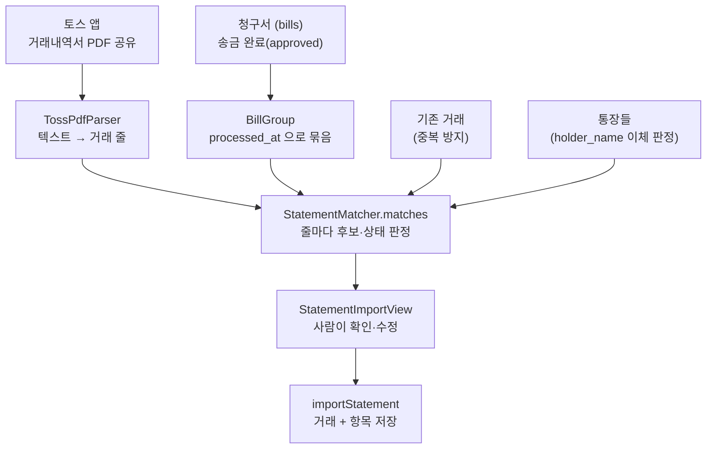

# 불러오기 및 매칭 (Import)

토스뱅크 모임통장 거래내역서를 장부에 넣는 곳이다. **이 앱의 핵심인 매칭이 여기서
일어난다** — 모임통장에 찍힌 출금 한 건이 어느 청구들에서 나온 것인지 찾아, 청구
제목을 항목의 적요로 옮겨 적는다.

- 매칭의 진실(정본)은 이 문서다.
- 기본 용어(항목·거래·적요·카테고리·청구 내역·내부 이체)는 [../README.md](../README.md) 에.
- 규칙화된 불변식은 [ARCHITECTURE.md](../../../ARCHITECTURE.md) "거래내역서는 청구서와 맞춰서 들어온다" 에.
- 화면 규칙(불러오기 계열의 문서화된 예외)은 [DESIGN.md](../../../DESIGN.md) §13 에.

---

## 왜 매칭이 필요한가

청구 탭에는 **묶어서 송금하기**가 있다. 한 사람에게 청구가 여러 건이면 묶어서 한 번에
보낸다. 그러면 모임통장에는 큰 금액 출금 **한 줄**만 찍힌다. 그래서 거래내역서의 출금
한 줄은 청구 여러 건일 수도, 한 건일 수도, 청구가 아예 없는 것(이자·회비 입금·ATM
출금·내부 이체)일 수도 있다.

매칭은 이 출금 줄에 대응하는 청구들을 찾아, **청구 제목을 항목의 적요로** 옮긴다.
사람이 손으로 하던 장부 작성을 대신하는 일이다.

---

## 파일 지도

| 파일 | 하는 일 |
| --- | --- |
| [`TossPdfParser.swift`](TossPdfParser.swift) | 토스 내역서 PDF 텍스트를 거래 줄(`ParsedStatementLine`)로 파싱. 상태 없는 순수 로직. |
| [`StatementMatcher.swift`](StatementMatcher.swift) | 매칭 정본. `BillGroup`·`StatementMatch`·`ItemSpec` 과 매칭 알고리즘. 상태·네트워크 없는 순수 로직. |
| [`FinanceViewModel+Statement.swift`](FinanceViewModel+Statement.swift) | 오케스트레이션 — 청구 조회, 파싱·매칭 실행, 확인이 끝난 것을 저장. |
| [`StatementImportView.swift`](StatementImportView.swift) | 넣기 전 사람이 확인하는 풀스크린. "생성된 청구 내역" 목록. |
| [`StatementItemDetailView.swift`](StatementItemDetailView.swift) | 항목 하나의 상세·편집(청구 정보 / 영수증 탭). |
| [`ImportEditPages.swift`](ImportEditPages.swift) | 상세에서 push 로 여는 편집 페이지(적요·카테고리 입력). |

**순수 로직(파서·매처)과 오케스트레이션·화면을 가른 게 이 폴더의 뼈대다.** 매처는
넣으면 나오는 함수라 단위 테스트가 쉽고, 화면과 저장이 **같은 답**(`itemSpecs`)을 쓴다.

---

## 전체 흐름

**아직 아무것도 저장하지 않고** 확인 화면까지 온다. 사람이 보고 고친 뒤에 넣는다.
기계가 지어낸 적요가 장부에 그대로 들어가면 안 되기 때문이다.

---

## 매칭 알고리즘

### Step 1 · 청구를 묶는다 (`BillGroup`)

송금 완료(`approved`)된 청구만 본다. **처리 시각(`processed_at`)이 같고 제출자
이름이 같은** 청구끼리 한 묶음이다. 묶음 금액은 청구 금액의 합이다.

**되는 이유가 여기 있다.** 묶어 보내기는 `updateStatus(billIds:)` 로 청구 여러 건을
**한 요청에** 승인하고, DB 트리거가 `now()` 를 찍는다. 그래서 같이 승인된 청구들의
`processed_at` 은 한 마이크로초까지 같다. 그 묶음의 합계가 곧 토스에서 빠져나간
금액이다.

묶음의 장부 줄은 **같은 제목을 한 줄로 합친다** — 사람이 손으로 적던 방식 그대로다.
처음 나온 순서를 지킨다(금액순으로 다시 세우면 사람이 적은 흐름이 흐트러진다).

### Step 2 · 줄마다 상태를 정한다

파싱된 거래 줄을 순회하며 셋으로 가른다.

1. **적요가 다른 통장의 예금주명(`holderName`)과 같은가** → 내부 이체. 통장은 둘뿐이라
   상대는 늘 '다른 통장 하나'다. 예산 수령 같은 농협↔모임 이체는 반드시 모임통장을
   지나므로 이 줄로 들어온다. 내부 이체는 총자산 변동이 없어 입출금과 다른 제3의
   상태다. **후보를 아예 만들지 않는다** — 금액이 우연히 청구 묶음과 같을 수 있어서다.
   > ⚠️ 이 판정은 **하드코딩이 아니다.** 코드는 `account.holderName` 을 정규화해
   > (`accountByAlias`) 적요와 맞춘다. 오늘 그 이름이 '예수교대한성결고천교'일 뿐,
   > 규칙은 통장 예금주명이다. 하드로 잠그면 이름이 우연히 같은 입금을 오탐하고,
   > 예금주명이 바뀌면 조용히 죽는다.
2. **금액이 0 이상인가** → 입금·이자. 나가는 돈이 아니라 맞을 청구가 없다.
3. **나머지(출금)** → 청구 묶음과 맞춰 본다.

### Step 3 · 후보를 뽑고 순위를 매긴다

**금액이 1차 키다.** 출금 크기와 묶음 합계가 같은 것을 후보로 뽑는다. 그중에서:

1. **시각 창(window)** 으로 거른다 — `processed_at` 과 거래 시각의 차이가 2일
   (`matchWindow`) 이내인 것만. 금액이 우연히 같을 뿐 몇 주씩 떨어진 청구가 붙는 걸
   막는다. (실제로 8/20 현금 5만 인출이 9/5 결혼축의금 5만에 붙은 적이 있다.)
2. **이름이 맞으면 앞**으로 — 토스는 예금주명을 안 적으면 받는 사람 이름이 적요에
   들어간다. 보낸 금액과 이름이 같으면 매칭 가능성이 높다.
3. **시각이 가까우면 앞**으로 — 송금하고 곧바로 완료 처리하는 게 보통이라, 송금 건은
   승인이 8~38초 뒤라 잘 맞는다.

> **시각·이름은 순위와 창일 뿐, 1차 키가 아니다.** 체크카드결제는 현장에서 긁고
> 승인이 나중이라 26~27시간까지 벌어지고, 적요가 예금주가 아니라 가맹점 이름
> (`우성볼링장`)이라 이름도 안 맞는다. 그래도 체크카드엔 애초에 청구가 없어 창이
> 좁아도 놓치는 게 없다.

> ⚠️ **시각에 시간대 변환을 넣지 말 것.** `Bill.processedAt` 도 `line.datetime` 도
> 절대 시각(`Date`)이라 그대로 빼면 된다. 대시보드에서 `to_char` 로 보면 UTC 라 9시간
> 어긋나 보이지만, 그건 찍어 보는 방식의 문제지 값의 문제가 아니다. 9시간을 더하면
> 오히려 전부 틀어진다.

**후보가 하나뿐이고 그 묶음이 다른 줄에는 안 걸릴 때만** 미리 골라 둔다(1:1 대응).
한 묶음이 여러 줄의 후보이면 어느 줄 것인지 알 수 없어 사람이 고른다.

### Step 4 · 이미 넣은 거래를 거른다

한 번 저장한 거래를 다시 넣지 않는다. 기존 거래와 **금액이 같고 시각 차이가 1초
미만**이면 같은 거래로 본다.

> 왜 1초 미만인가 — `Date` 는 기준 시각부터의 초를 `TimeInterval`(부동소수)로 들고
> 있어 소수부에 오차가 날 여지가 있다. `==` 대신 "1초 미만"으로 본다.

이 중복 방지를 **불러오기 경로에서만** 여기서 한다. 예전엔 DB 의
`unique(ledger_id, datetime, amount)` 제약이 막았는데, 그 제약이 같은 날 같은 금액의
수기 입력 둘을 막아 버려 걷어냈다. 손으로 넣는 쪽은 계속 자유롭다.

### Step 5 · 결과 다섯 가지

| 상태 | 뜻 | 장부에 들어가나 |
| --- | --- | --- |
| 청구서와 맞았어요 | 1:1 자동 매칭 또는 사람이 직접 고름 | ○ (청구 제목이 적요) |
| 확인이 필요해요 | 후보가 여럿 — 사람이 고른다 | 고르면 ○ |
| 청구가 없어요 | 후보 없음 | ○ (통짜 한 항목, 또는 사람이 적은 적요) |
| 통장 사이 이체에요 | 적요가 다른 통장 예금주명 | ○ (이체 항목 하나) |
| 이미 장부에 있어요 | 과거에 저장한 거래를 또 읽음 | ✕ |

"이미 장부에 있어요"만 빼고 전부 항목으로 들어간다.

---

## 확인 화면에서 사람이 하는 일

`StatementImportView` 의 목록은 은행 거래가 아니라 **장부에 들어갈 항목**을 한 줄씩
보여준다(묶음은 조각마다 한 줄). 행을 누르면 `StatementItemDetailView` 상세로 들어가,
항목별로 고칠 수 있다.

- **청구 선택** — "확인이 필요해요"인 줄에서 후보를 고른다.
- **적요** — 청구 없이 넣는 줄에 사람이 이름을 적는다(비우면 은행 적요 그대로).
- **카테고리** — 항목별로 붙인다. 묶음도 조각마다 다르게 붙일 수 있다
  (`itemCategories` — 장부가 원래 항목별 카테고리라서).
- **이체 토글** — 매처가 예금주명으로 잡은 내부 이체를 사람이 끌 수 있다. 이름이
  우연히 같을 수 있어서다. (수기 항목은 이체일 수 없어 토글이 없다.)

---

## 저장 — 두 층으로 나뉜다

`importStatement` 이 두 가지를 넣는다. 근거는 [ARCHITECTURE.md](../../../ARCHITECTURE.md)
"통장은 둘, 장부는 하나".

1. **거래(`finance_transactions`)** — 통장에 찍힌 **은행 증명**. 손대지 않고 그대로 넣는다.
2. **항목(`finance_items`)** — 장부에 적힐 **정본**. 무엇이 항목이 되는지는
   `StatementMatch.itemSpecs` 하나가 정한다(화면과 저장이 같은 답을 쓴다):
   - 청구 묶음을 골랐으면 → 제목마다 한 항목(영수증도 항목별로 딸려 온다).
   - 사람이 적요·카테고리만 적었으면 → 한 항목.
   - 내부 이체면 → 이체 항목 하나(`is_internal_transfer = true`).
   - 아무것도 없으면 → 통짜 한 항목(적요는 은행 값으로).

**모든 거래는 최소 한 항목으로 완전히 풀려야** 은행 증명과 장부가 대조된다.

거래를 한 번에 넣고 돌려받은 행을 **금액·시각으로 되찾아**(`< 1초`) 항목을 붙인다.
INSERT 가 돌려주는 순서를 믿지 않기 때문이다.

> **매칭은 일회성 복사다.** 청구↔거래를 잇는 `bill_id` 는 없다. 청구의 영수증을
> 항목으로 복사할 뿐이라, 이미 들어온 거래에 뒤늦게 청구가 자동으로 붙지는 않는다.

---

## 되돌리지 말 것 (이 폴더 몫)

전체 목록과 근거는 [ARCHITECTURE.md](../../../ARCHITECTURE.md) 와 루트
[CLAUDE.md](../../../CLAUDE.md) 에. 여기서 특히 조심할 것:

- **내부 이체 판정을 하드로 잠그지 말 것** — `holderName` 매칭이라 오탐이 날 수 있어
  확인 화면에서 사람이 끈다. 예금주명 상수를 코드에 박으면 안 된다.
- **시각에 시간대 변환을 넣지 말 것** — 둘 다 절대 시각이다(Step 3 경고).
- **`matchWindow`(2일)를 없애지 말 것** — 금액만으로 붙이면 몇 주 떨어진 청구가 붙는다.
- **내부 이체 줄을 안 넣거나 두 줄로 넣지 말 것** — 한 항목(`is_internal_transfer`)이
  양쪽 통장을 안다.
- **중복 방지를 DB 유니크 제약으로 되돌리지 말 것** — 수기 입력을 막는다. 불러오기
  경로에서만 Step 4 로 한다.
