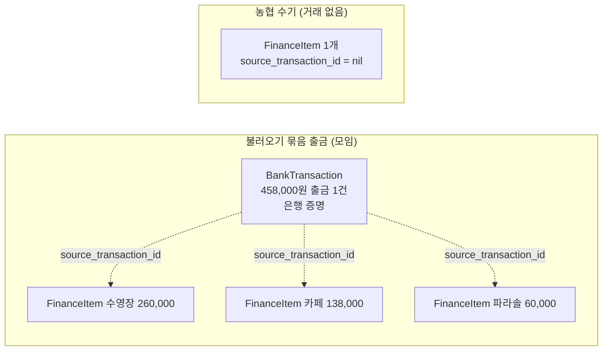
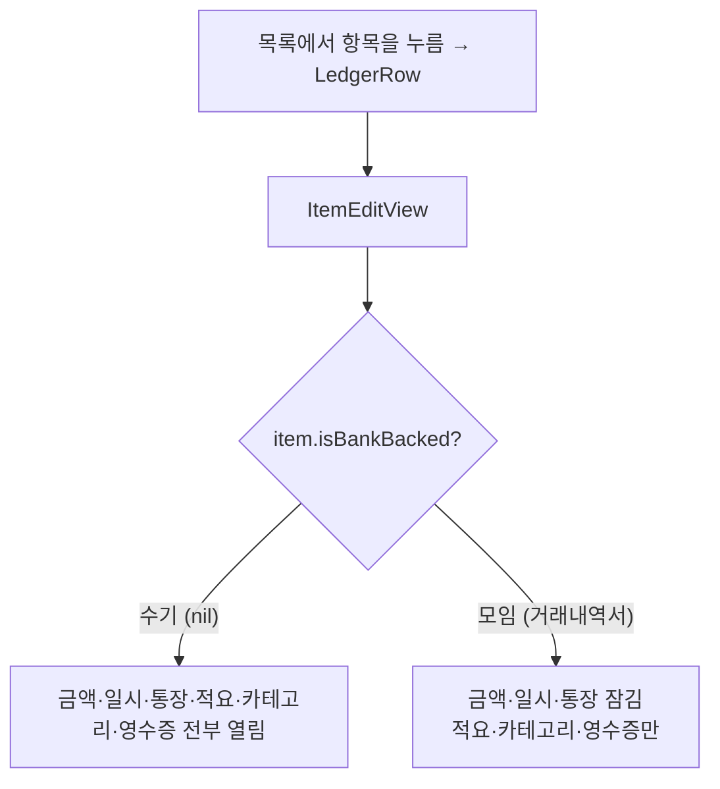

# 재정 (Finance)

농협 통장과 토스뱅크 모임통장의 거래내역을 하나의 장부에 작성하는데 필요한 기능들을 제공한다.


## 규칙
- 디자인 관련 규칙은 [DESIGN.md](../../../DESIGN.md) 을 참고한다.
- 사실 확인되어 규칙화 된 것은 [ARCHITECTURE.md](../../../ARCHITECTURE.md) 을 참고한다.

## 용어 정리
재정 탭에서 주로 언급되는 것들에 대해 용어를 정의한다.

- 항목 : 장부에 찍히는 입출금 내역 한 줄을 의미한다. 예를 들어, `통장 이자    +46원`, `청년부 회식·행사비    -180000원` 등에 해당한다.
- 거래 : 토스뱅크 거래내역서에 찍혀있는 입출금 내역 한 줄을 의미한다. 예를 들어, `이승호 -4860000원` 등에 해당한다. 앱에서 청구 내역을 묶어보낼 경우, 토스 거래내역서에는 하나의 출금 내역만이 찍히기 때문에 거래는 항목들의 합계일 수 있다.
- 적요 : 항목에서 지출 내용이 무엇인지를 설명하는 텍스트. 예를 들어, `통장 이자`, `청년부 회식` 등이 있다.
- 카테고리 : 입출금 항목들을 성격에 맞게 분류하기 위한 꼬리표. 예를 들어, `행사비`, `헌금`, `후원금` 등이 있다.
- 청구 내역 : 청구서 탭에 찍혀있는 내역 한 줄을 의미한다. 재정 탭에서는 청구 내역 중 `송금 완료` 처리된 데이터를 활용하여 `매칭` 작업을 수행한다.
- 매칭 : 송금 완료 처리된 청구 내역들을 거래에 적절히 매핑시켜 장부에 추가할 항목을 생성하는 과정. 매칭 알고리즘은 후술할 예정.
- 통장 사이 이체 : 농협 통장과 토스 모임통장 간 사이에서 일어난 입출금 내역을 의미한다. 이것은 내부에서 일어나는 이체이므로 총 자산에 영향을 주지 않는 행위이다. 따라서 입출금과 다른 제3의 상태로 보고, 장부의 입출금 쪽에는 영향을 주어서는 안된다.

## 핵심 기능

재정 탭이 제공하는 기능은 크게 네 가지로 나뉜다.

| 기능 | 하는 일 | 주요 파일 |
| --- | --- | --- |
| 조회 및 분석 | 목록 조회, 요약, 그래프 시각화, 잔액 확인 | `FinanceView`, `FinanceSummaryBand`, `FinanceDaySelector`, `FinanceMonthStepper`, `SpendingDetailView`, `AccountBalanceView`, `+Summary`/`+Balance`/`+Month` |
| 거래 CRUD | 수기 추가, 항목 편집, 삭제, 병합, 카테고리 라벨링 | `AddTransactionView`, `ItemEditView`, `+Edit` |
| 불러오기 및 매칭 | 토스 거래내역서 파싱 → 매칭 → 거래 생성 | `StatementImportView`, `StatementMatcher`, `TossPdfParser`, `+Statement` |
| 내보내기 | 월별 보고서, 영수증 부록 | `FinanceReportExporter`, `FinanceReportPreviewView`, `+Export` |

## 사용자 시나리오

1. 농협 통장에 적힌 내역(대부분 입금 내역)을 수기로 작성한다.
2. 토스뱅크 모임통장에서 거래내역서를 pdf 파일로 내보낸다 (토스 → 앱)
3. 거래내역서 파일을 파싱 후, `매칭` 을 통해 청구 내역에 해당하는 토스뱅크 거래 내역을 찾는다.
4. 해당 내역을 확인 후, 장부에 추가한다.

## 데이터 흐름

```mermaid
flowchart TD
    bills["청구서 (bills)<br/>송금 완료"]
    parser["TossPdfParser<br/>거래내역서 파싱"]
    matcher["StatementMatcher<br/>청구 내역과 매칭"]
    imp["StatementImportView<br/>확인 후 장부에 추가"]
    add["AddTransactionView<br/>농협 수기 작성"]
    tx["BankTransaction<br/>은행 증명 (모임)"]
    items["FinanceItem<br/>장부 정본 (항목)"]
    rows["LedgerRow"]
    out["목록, 요약, 보고서"]

    bills --> matcher
    parser --> matcher
    matcher --> imp
    imp -->|거래 + 항목 생성| tx
    imp --> items
    add -->|항목만 생성 (거래 없음)| items
    bills -. 영수증 한 번 복사 .-> items
    tx -. 은행 증명 .-> items
    items --> rows --> out
```

## 파일 지도

**핵심 기능 네 갈래가 그대로 폴더다.** 공용·코어만 루트에 둔다. (Xcode 파일시스템
동기화 그룹이라 폴더에 넣으면 자동 인식된다.)

### 루트 (공용·코어)
- **`FinanceView.swift`** — 탭 화면 조립. 헤더(거래추가 · 월넘김 · 카테고리 · 메뉴), 칩
  셀렉터, 목록(`scrollingContent`/`daySection`), 선택 모드, 상태를 갖는다.
- **`FinanceViewModel.swift`** — 저장 프로퍼티(@Published) + 조회 코어
  (`filtered`·`filteredExternal`·`ledgerRows`·`rows(of:)` 등). 모든 파생값이 여기서 시작한다.
- **`FinanceViewModel+Load.swift`** — 항목·통장·거래 로드(`start`·`fetch*`).
- **`FinanceMenuView.swift`** — 헤더 햄버거(≡)가 여는 풀스크린 메뉴(통장 잔액·내보내기).
- **`FinanceHelpers.swift`** — UI 보조 타입/뷰(`DayGroup`·`ExportFile`·`ReportPreview`
  ·`SpendingComparison`·`ChipFlowLayout`·`FinanceLedgerGateView` 등).

### `Overview/` (조회 및 분석)
- **`FinanceMonthStepper.swift`** — 헤더 가운데 월 넘김.
- **`FinanceSummaryBand.swift`** — Hero 요약 밴드(총입금/총출금 + 지난달 대비 + 스파크라인).
- **`FinanceDaySelector.swift`** — 주 단위 날짜 셀렉터.
- **`LedgerRowView.swift`** — 목록의 한 항목(`LedgerRow`).
- **`AccountBalanceView.swift`** — 통장별 잔액·총 재정.
- **`SpendingDetailView.swift`** — 소비 분석(요약 밴드 "자세히 보기").
- **`FinanceViewModel+Summary.swift`** — 요약·그래프·보고서 집계(`reportItems`·`comparison`·`dailyNet`…).
- **`FinanceViewModel+Balance.swift`** — 잔액 유도(`balance`·`totalBalance`·내부이체 흐름).
- **`FinanceViewModel+Month.swift`** — 달 넘김·달력(주/일 계산).

### `Transactions/` (거래 CRUD)
- **`ItemEditView.swift`** — **항목 하나의 상세·편집.** 거래·조각 구분 없이 이 화면
  하나가 다 받는다. 값을 죽 나열하고 고칠 수 있는 것에만 chevron 을 달아 필드별 시트로
  고친다. **무엇을 고칠 수 있나는 은행 증명 유무(`item.isBankBacked`)가 정한다** —
  농협 수기 항목은 금액·일시·통장까지 열리고, 거래내역서에서 온 모임 항목은 그 셋이
  은행 값이라 잠긴다(카테고리·적요·영수증만).
- **`TransactionEditShared.swift`** — 편집 화면 공용 섹션(`DetailRow` 등). 값을 나열하고
  chevron 이 있는 줄만 편집 시트를 여는 상세 문법을 담는다.
- **`Receipts.swift`** — 영수증 관리·전체화면 뷰어·카메라(`ReceiptManagerView`
  ·`ReceiptViewerView`·`CameraPicker`·`PendingImage`·`ReceiptSource`).
- **`AddTransactionView.swift`** — 농협 수기 추가(빠른 반복 입력. 카테고리·분할 없음).
- **`WeekDatePicker.swift`** — 거래 추가에서 날짜를 고르는 가로 주 단위 셀렉터.
- **`CategoryAssignView.swift`** — 선택 모드에서 여러 항목에 카테고리를 한 번에 붙이는 시트.
- **`FinanceViewModel+Edit.swift`** — 항목 쓰기(수기 추가·필드 편집·삭제·병합·카테고리 추가).

### `Import/` (불러오기 및 매칭)
- **`StatementImportView.swift`** — 거래내역서를 장부에 넣기 전 사람이 확인하는 화면.
- **`StatementMatcher.swift`** — 상태 없는 순수 매칭 로직(`BillGroup`·`StatementMatch`).
- **`TossPdfParser.swift`** — 토스 내역서 PDF 텍스트 파싱.
- **`FinanceViewModel+Statement.swift`** — 거래내역서 불러오기·매칭 실행.

### `Export/` (내보내기)
- **`FinanceReportExporter.swift`** — 보고서/영수증 PDF(`UIFont` 로 직접 그림, `DS` 밖).
- **`FinanceReportPreviewView.swift`** — 보고서 HTML 미리보기(WKWebView).
- **`FinanceViewModel+Export.swift`** — 보고서/영수증 PDF 생성 트리거.

### `Models/`
순수 데이터 타입(`import Foundation`). 엔티티 + 그 DTO(Insert/Patch)를 한 파일로.
- `Account` · `BankTransaction`(은행 증명) · `FinanceItem`(장부 정본, + `FinanceItemInsert`
  ·`ItemFieldsUpdate`·`CategoryPatch`) · `LedgerRow`(항목을 감싼 목록 한 줄)
  · `ReportModels`(ReportLineItem·CategoryTotal) · `IncomingStatement`.

---

## 핵심 모델

### 항목이 곧 장부 줄이다 (`FinanceItem`)
목록·보고서의 한 줄은 은행 거래가 아니라 **항목(`FinanceItem`)**이다. 항목이 장부
정본이고, 거래(`BankTransaction`)는 그 뒤의 **은행 증명**일 뿐이다. 근거는
[ARCHITECTURE.md](../../../ARCHITECTURE.md) "통장은 둘, 장부는 하나".
- 불러오기 묶음 출금 하나(모임) → **항목 여럿.** 같은 `sourceTransactionId` 를 공유한다.
- 미매칭·내부 이체(모임) → 항목 하나.
- 농협 수기 → 거래 없이 **항목만**(`sourceTransactionId == nil`).

`rows(of:)`([FinanceViewModel.swift](FinanceViewModel.swift))가 항목을 정렬해
`LedgerRow`(항목 + 그 은행 거래)로 감싼다. 칩 개수도 항목 수(=엑셀 장부 줄 수)와 같다.



### 목록 → 항목 편집 (`ItemEditView`)
목록에서 줄을 누르면 그 항목(`LedgerRow`)을 `.fullScreenCover(item:)` 로
`ItemEditView` 에 넘긴다. **거래·조각 구분 없이 화면 하나가 다 받는다** — 예전의
`TransactionEditView`/`PieceEditView` 두 갈래를 하나로 합쳤다. 무엇을 고칠 수 있나는
`item.isBankBacked`(= `sourceTransactionId != nil`)가 정한다:
- **농협 수기 항목** → 금액·일시·통장까지 열림.
- **거래내역서에서 온 모임 항목** → 그 셋은 은행 값이라 chevron 이 없다(잠김).
  카테고리·적요·영수증만 고친다.

값을 죽 나열하고 chevron 이 있는 줄만 필드별 시트를 여는 문법을 `TransactionEditShared`
로 공유하고, 저장은 `saveItemFields`(모임)·`saveManualItem`(농협)으로 수렴한다.



### 매칭은 일회성 복사다 (bill_id 없음)
청구↔항목 연결은 불러오기 순간에 청구의 `receipt_url` 을 항목 `receipt_urls` 로
**복사**할 뿐, `finance_items`·`finance_transactions` 에 `bill_id` 는 없다. 이미
들어온 거래에 뒤늦게 청구를 자동으로 붙이지 않는다 — 사후 편집(분할 재편집·이체
토글)은 아직 없고, 지금은 불러오기 확인 화면에서 미리 잡는다.

### 잔액은 저장하지 않는다
`balance` 컬럼이 없다. 통장 개시잔액에서 항목을 누적해 유도한다(`+Balance`).
합계·보고서·그래프는 내부이체를 뺀 `filteredExternal` 을 쓴다.

---

## 매칭 알고리즘

**매칭의 정본은 [`Import/README.md`](Import/README.md) 로 옮겼다.** 청구 묶기
(`processed_at`), 후보 순위(금액 1차 키·시각 창·이름), 내부 이체 판정(`holderName`),
중복 방지, 결과 다섯 가지, 그리고 두 층(거래·항목) 저장까지 거기에 있다. 규칙화된
불변식은 [ARCHITECTURE.md](../../../ARCHITECTURE.md) "거래내역서는 청구서와 맞춰서
들어온다" 에.

---

## 현재 상태 / 미결

- **내보내기는 PDF만 구현됨.** 엑셀(xlsx) 내보내기는 논의/가능성 증명만 있고 앱에
  안 붙었다. 붙이려면 `+Export` + `FinanceReportExporter` 에 별도 경로가 필요하다.
- **편집창 남은 다듬기**: 항목 편집 전환은 됐으나, 통장 사이 이체 토글·카테고리·분할·
  삭제 섹션의 시각 정리는 다음 라운드로 미뤄 둠.
- 그 밖의 남은 일은 [DESIGN.md](../../../DESIGN.md) 맨 아래와
  [SETUP.md](../../../SETUP.md) 의 ⬜ 항목에.
