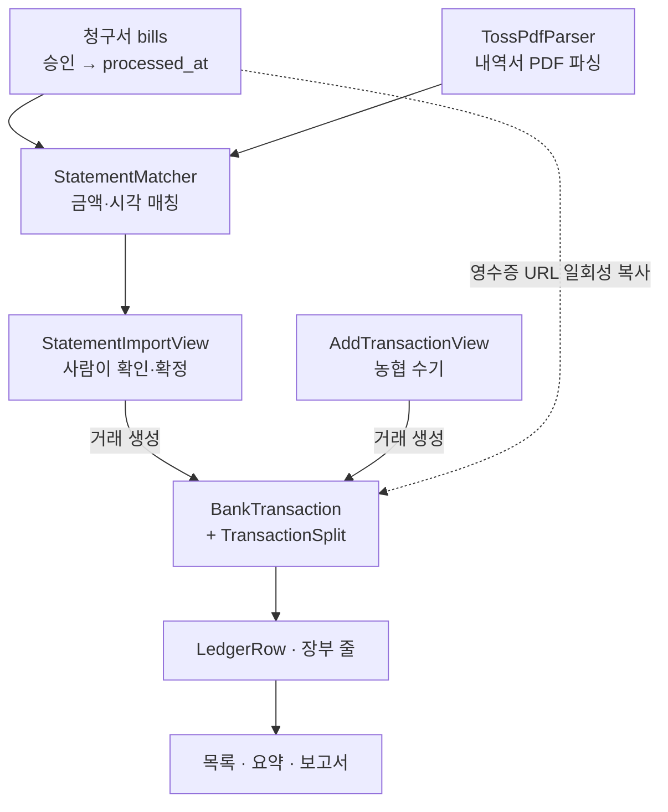
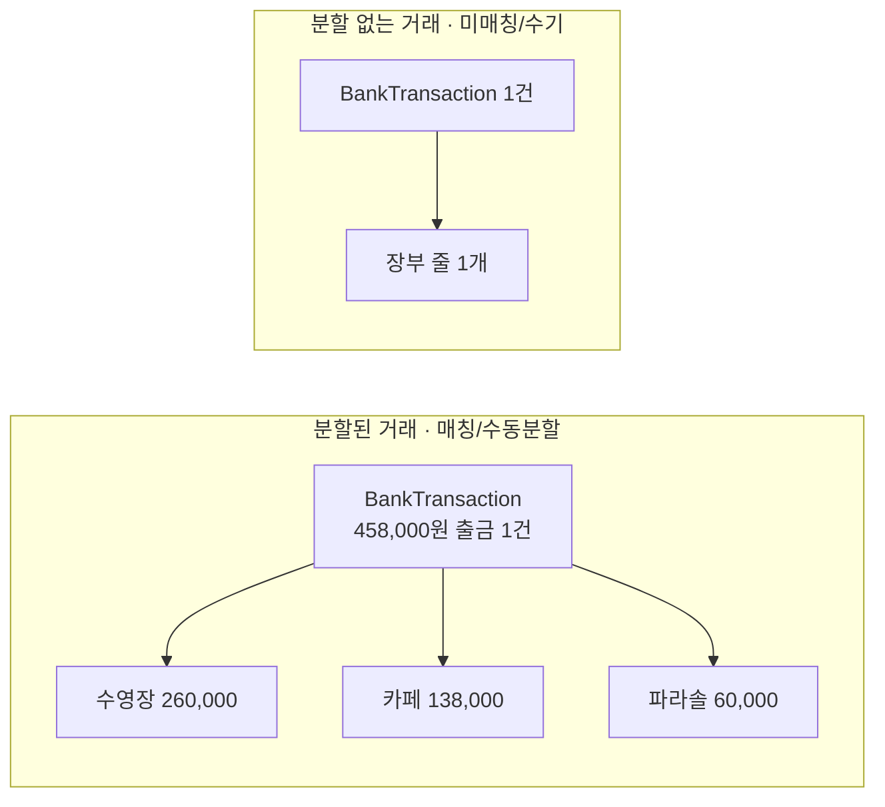
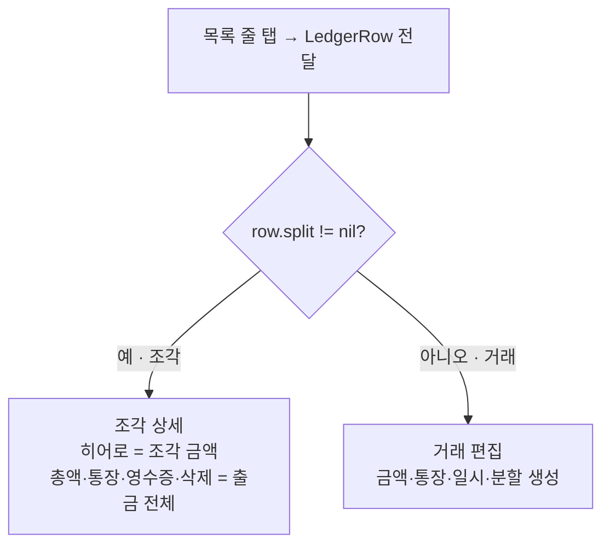

# 재정 (Finance)

농협 통장과 토스뱅크 모임통장의 거래내역을 하나의 장부에 작성하는데 필요한 기능들을 제공한다.

## 규칙
- 디자인 관련 규칙은 [DESIGN.md](../../../DESIGN.md) 을 참고한다.
- 사실 확인되어 규칙화 된 것은 [ARCHITECTURE.md](../../../ARCHITECTURE.md) 을 참고한다.

## 핵심 기능

재정 탭이 제공하는 기능은 크게 네 가지로 나뉜다.

| 기능 | 하는 일 | 주요 파일 |
| --- | --- | --- |
| 조회 및 분석 | 목록 조회, 요약, 그래프 시각화, 잔액 확인 | `FinanceView`, `FinanceSummaryBand`, `FinanceDaySelector`, `FinanceMonthStepper`, `SpendingDetailView`, `AccountBalanceView`, `+Summary`/`+Balance`/`+Month` |
| 거래 CRUD | 수기 추가, 편집, 삭제, 카테고리 라벨링 | `AddTransactionView`, `TransactionEditView`, `+Edit` |
| 불러오기 및 매칭 | 토스 거래내역서 파싱 → 매칭 → 거래 생성 | `StatementImportView`, `StatementMatcher`, `TossPdfParser`, `+Statement` |
| 내보내기 | 월별 보고서, 영수증 부록 | `FinanceReportExporter`, `FinanceReportPreviewView`, `+Export` |

## 사용자 시나리오

1. 농협 통장에 적힌 내역(대부분 입금 내역)을 수기로 작성한다.
2. 토스뱅크 모임통장에서 거래내역서를 pdf 파일로 내보낸다 (토스 → 앱)
3. 거래내역서 파일을 파싱 후, `매칭` 을 통해 청구 내역에 해당하는 토스뱅크 거래 내역을 찾는다.
4. 해당 내역을 확인 후, 장부에 추가한다.

## 데이터 흐름

## 파일 지도

### 화면 (재정 탭 메인)
- **`FinanceView.swift`** — 화면 조립. 헤더(거래추가 · 월넘김 · 분류 · 메뉴), 칩
  셀렉터, 목록(`scrollingContent`/`daySection`), 선택 모드, 상태를 갖는다.
- **`FinanceMonthStepper.swift`** — 헤더 가운데 월 넘김.
- **`FinanceSummaryBand.swift`** — Hero 요약 밴드(총입금/총출금 + 지난달 대비 + 스파크라인).
- **`FinanceDaySelector.swift`** — 주 단위 날짜 셀렉터.
- **`LedgerRowView.swift`** — 목록 한 줄(장부 줄).
- **`FinanceMenuView.swift`** — 헤더 햄버거(≡)가 여는 풀스크린 메뉴(통장 잔액·내보내기).
- **`CategoryAssignView.swift`** — 선택 모드에서 여러 줄에 분류를 한 번에 붙이는 시트.

### 화면 (시트/서브)
- **`TransactionEditView.swift`** — **탭 → 상세/편집.** 조각을 누르면 조각 상세,
  분할 없는 거래를 누르면 거래 편집. `ReceiptManagerView`·`SplitEditSheet`·영수증
  뷰어를 함께 담는다. (조각/거래 구분은 아래 "핵심 모델" 참고)
- **`AddTransactionView.swift`** — 농협 수기 추가(빠른 반복 입력. 분류·분할 없음).
- **`AccountBalanceView.swift`** — 통장별 잔액·총 재정.
- **`SpendingDetailView.swift`** — 소비 분석(요약 밴드 "자세히 보기").

### 뷰모델 (`FinanceViewModel` + 확장)
본체는 얇게 두고 기둥별 `extension` 파일로 나눈다.
- **`FinanceViewModel.swift`** — 저장 프로퍼티(@Published) + 조회 코어
  (`filtered`·`ledgerRows`·`splits(for:)` 등). 모든 파생값이 여기서 시작한다.
- **`+Balance`** — 잔액 유도(`balance`·`totalBalance`·내부이체 흐름).
- **`+Month`** — 달 넘김·달력(주/일 계산).
- **`+Summary`** — 요약·그래프·보고서 집계(`reportItems`·`comparison`·`dailyNet`…).
- **`+Ledger`** — 장부·통장·거래 로드(`start`·`fetch*`).
- **`+Statement`** — 거래내역서 불러오기·매칭 실행.
- **`+Export`** — 보고서/영수증 PDF 생성 트리거.
- **`+Edit`** — 거래 쓰기(추가·편집·삭제·분류 붙이기).

### 모델 (`Models/`)
순수 데이터 타입(`import Foundation`). 엔티티 + 그 DTO(Insert/Patch)를 한 파일로.
- `Ledger` · `Account` · `BankTransaction` · `TransactionSplit` · `LedgerRow`
  · `ReportModels`(ReportLineItem·CategoryTotal) · `IncomingStatement`.

### 로직·출력물
- **`StatementMatcher.swift`** — 상태 없는 순수 매칭 로직(`BillGroup`·`StatementMatch`).
- **`TossPdfParser.swift`** — 토스 내역서 PDF 텍스트 파싱.
- **`FinanceReportExporter.swift`** — 보고서/영수증 PDF(‌`UIFont` 로 직접 그림, `DS` 밖).
- **`FinanceReportPreviewView.swift`** — 보고서 HTML 미리보기(WKWebView).
- **`FinanceHelpers.swift`** — UI 보조 타입/뷰(`DayGroup`·`ExportFile`·`ReportPreview`
  ·`SpendingComparison`·`ChipFlowLayout`·`FinanceLedgerGateView` 등).

---

## 핵심 모델

### 장부 줄 = 조각(split) 또는 거래
목록의 한 줄은 **은행 거래가 아니라 "장부 줄"**이다.
- 거래가 분할돼 있으면(매칭·수동분할) → **조각마다 한 줄**. 묶어보내기 출금 하나는
  여러 줄이 된다.
- 분할이 없으면(미매칭·수기) → 거래 하나가 한 줄.
- 내부 이체는 안 쪼갠다 → 한 줄.

`ledgerRows(of:)`([FinanceViewModel.swift](FinanceViewModel.swift))가 이 펼침을 한다.
칩 개수도 조각 수(=엑셀 장부 줄 수)와 같다.

### 탭 → 조각 상세
목록 줄을 누르면 **그 줄(`LedgerRow`, 조각 정보 포함)**을 넘긴다.
`TransactionEditView` 는 `row.split != nil` 이면 **조각 상세**(그 조각 금액·적요·분류만,
총액·통장·영수증·삭제는 "속한 출금 전체"로 표시), 아니면 **거래 편집**을 그린다.

### 매칭은 일회성 복사다 (bill_id 없음)
청구↔거래 연결은 불러오기 순간에 청구의 `receipt_url` 을 거래 `receipt_urls` 로
**복사**할 뿐, `finance_transactions` 에 `bill_id` 는 없다. 이미 들어온 거래에
뒤늦게 청구를 넣어도 **자동으로 안 붙는다** — 그때는 편집창에서 수동 분할/영수증
첨부로 바로잡는다. (분할 "생성"이 미매칭 거래에서만 뜨는 이유)

### 잔액은 저장하지 않는다
`balance`컬럼이 없다. 통장 개시잔액에서 거래를 누적해 유도한다(`+Balance`).
합계·보고서·그래프는 내부이체를 뺀 `filteredExternal` 을 쓴다.

---

## 현재 상태 / 미결

- **내보내기는 PDF만 구현됨.** 엑셀(xlsx) 내보내기는 논의/가능성 증명만 있고 앱에
  안 붙었다. 붙이려면 `+Export` + `FinanceReportExporter` 에 별도 경로가 필요하다.
- **편집창 남은 다듬기**: 조각-상세 전환은 됐으나, 통장 사이 이체 토글·분류·분할·
  삭제 섹션의 시각 정리는 다음 라운드로 미뤄 둠.
- 그 밖의 남은 일은 [DESIGN.md](../../../DESIGN.md) 맨 아래와
  [SETUP.md](../../../SETUP.md) 의 ⬜ 항목에.
