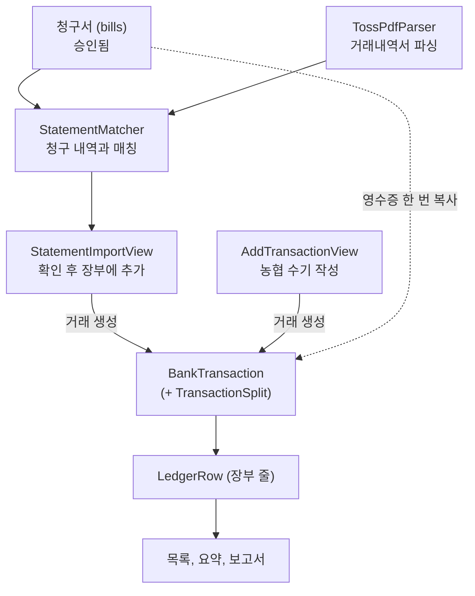
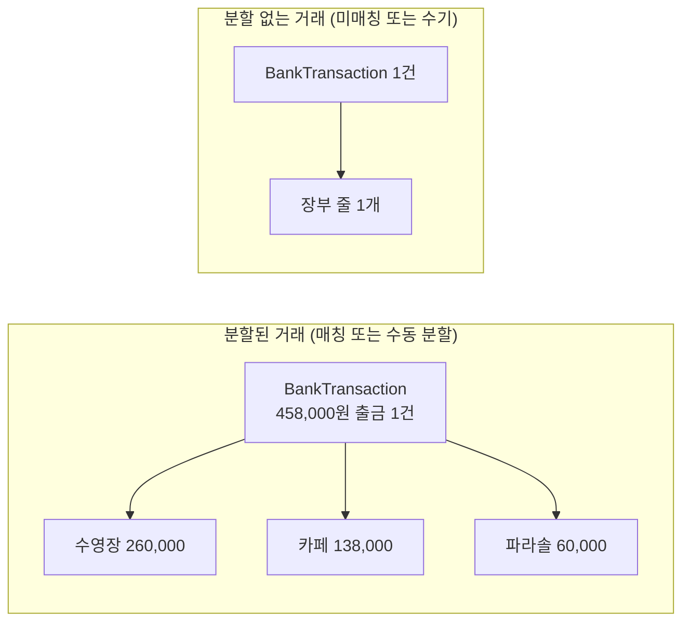
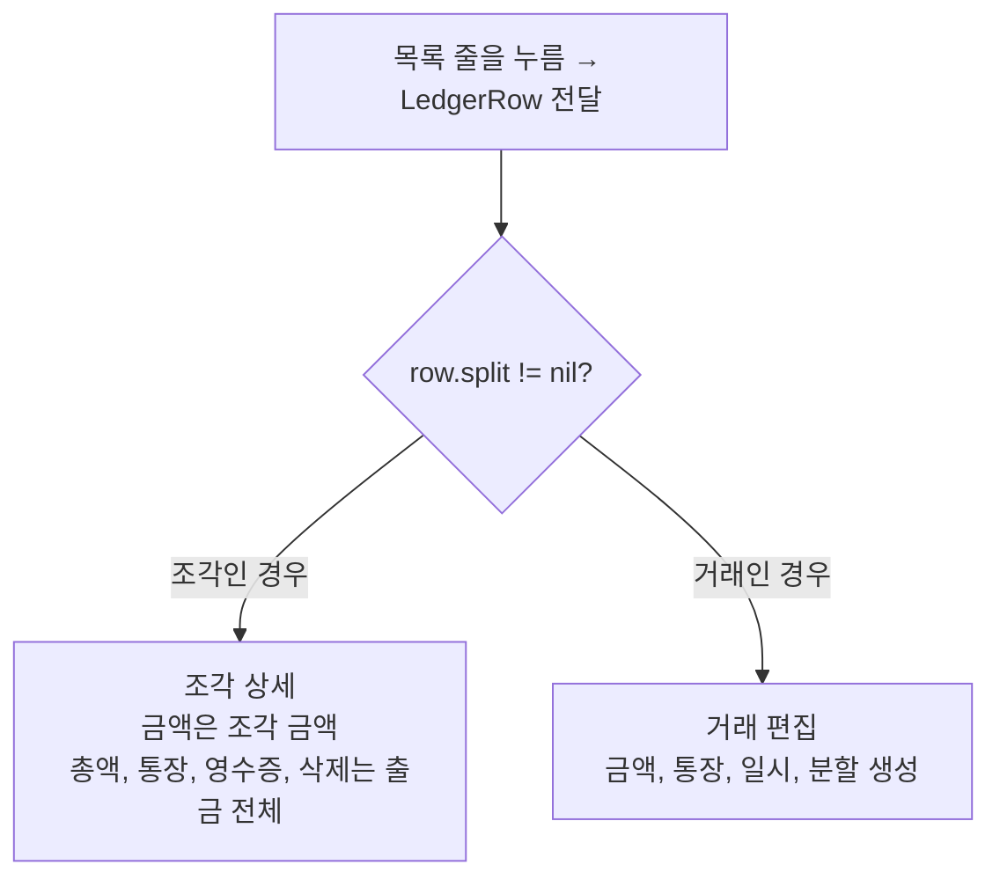
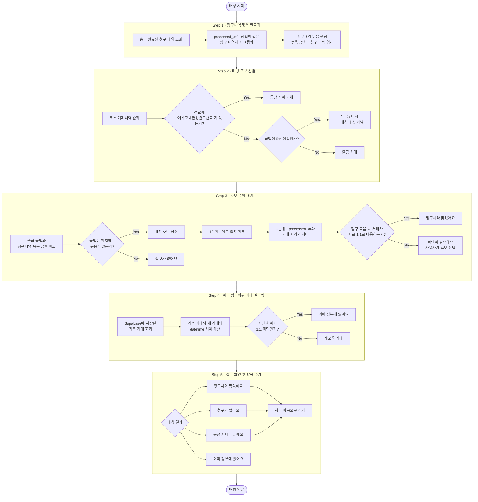

# 재정 (Finance)

농협 통장과 토스뱅크 모임통장의 거래내역을 하나의 장부에 작성하는데 필요한 기능들을 제공한다.

## 규칙
- 디자인 관련 규칙은 [DESIGN.md](../../../DESIGN.md) 을 참고한다.
- 사실 확인되어 규칙화 된 것은 [ARCHITECTURE.md](../../../ARCHITECTURE.md) 을 참고한다.

## 용어 정리
재정 탭에서 주로 언급되는 것들에 대해 용어를 정의한다.

- 항목 : 장부에 찍히는 입출금 내역 한 줄을 의미한다. 예를 들어, `통장 이자    +46원`, `청년부 회식·행사비    -180000원` 등에 해당한다.
- 거래 : 토스뱅크 거래내역서에 찍혀있는 입출금 내역 한 줄을 의미한다. 예를 들어, `이승호 -4860000원` 등에 해당한다. 앱에서 청구 내역을 묶어보낼 경우, 토스 거래내역서에는 하나의 출금 내역만이 찍히기 때문에 거래는 항목들의 합계일 수 있다.
- 적요 : 항목에서 지출 내용이 무엇인지를 설명하는 텍스트. 예를 들어, `통장 이자`, `청년부 회식` 등이 있다.
- 카테고리 : 입출금 항목들을 성격에 맞게 분류하기 위한 꼬리표. 예를 들어, `행사비`, `헌금`, `후원금` 등이 있다.
- 청구 내역 : 청구서 탭에 찍혀있는 내역 한 줄을 의미한다. 재정 탭에서는 청구 내역 중 `송금 완료` 처리된 데이터를 활용하여 `매칭` 작업을 수행한다.
- 매칭 : 송금 완료 처리된 청구 내역들을 거래에 적절히 매핑시켜 장부에 추가할 항목을 생성하는 과정. 매칭 알고리즘은 후술할 예정.
- 통장 사이 이체 : 농협 통장과 토스 모임통장 간 사이에서 일어난 입출금 내역을 의미한다. 이것은 내부에서 일어나는 이체이므로 총 자산에 영향을 주지 않는 행위이다. 따라서 입출금과 다른 제3의 상태로 보고, 장부의 입출금 쪽에는 영향을 주어서는 안된다.

## 핵심 기능

재정 탭이 제공하는 기능은 크게 네 가지로 나뉜다.

| 기능 | 하는 일 | 주요 파일 |
| --- | --- | --- |
| 조회 및 분석 | 목록 조회, 요약, 그래프 시각화, 잔액 확인 | `FinanceView`, `FinanceSummaryBand`, `FinanceDaySelector`, `FinanceMonthStepper`, `SpendingDetailView`, `AccountBalanceView`, `+Summary`/`+Balance`/`+Month` |
| 거래 CRUD | 수기 추가, 편집, 삭제, 카테고리 라벨링 | `AddTransactionView`, `TransactionEditView`, `+Edit` |
| 불러오기 및 매칭 | 토스 거래내역서 파싱 → 매칭 → 거래 생성 | `StatementImportView`, `StatementMatcher`, `TossPdfParser`, `+Statement` |
| 내보내기 | 월별 보고서, 영수증 부록 | `FinanceReportExporter`, `FinanceReportPreviewView`, `+Export` |

## 사용자 시나리오

1. 농협 통장에 적힌 내역(대부분 입금 내역)을 수기로 작성한다.
2. 토스뱅크 모임통장에서 거래내역서를 pdf 파일로 내보낸다 (토스 → 앱)
3. 거래내역서 파일을 파싱 후, `매칭` 을 통해 청구 내역에 해당하는 토스뱅크 거래 내역을 찾는다.
4. 해당 내역을 확인 후, 장부에 추가한다.

## 데이터 흐름

## 파일 지도

### 화면 (재정 탭 메인)
- **`FinanceView.swift`** — 화면 조립. 헤더(거래추가 · 월넘김 · 분류 · 메뉴), 칩
  셀렉터, 목록(`scrollingContent`/`daySection`), 선택 모드, 상태를 갖는다.
- **`FinanceMonthStepper.swift`** — 헤더 가운데 월 넘김.
- **`FinanceSummaryBand.swift`** — Hero 요약 밴드(총입금/총출금 + 지난달 대비 + 스파크라인).
- **`FinanceDaySelector.swift`** — 주 단위 날짜 셀렉터.
- **`LedgerRowView.swift`** — 목록 한 줄(장부 줄).
- **`FinanceMenuView.swift`** — 헤더 햄버거(≡)가 여는 풀스크린 메뉴(통장 잔액·내보내기).
- **`CategoryAssignView.swift`** — 선택 모드에서 여러 줄에 분류를 한 번에 붙이는 시트.

### 화면 (시트/서브)
- **`TransactionEditView.swift`** — **탭 → 상세/편집.** 조각을 누르면 조각 상세,
  분할 없는 거래를 누르면 거래 편집. `ReceiptManagerView`·`SplitEditSheet`·영수증
  뷰어를 함께 담는다. (조각/거래 구분은 아래 "핵심 모델" 참고)
- **`AddTransactionView.swift`** — 농협 수기 추가(빠른 반복 입력. 분류·분할 없음).
- **`AccountBalanceView.swift`** — 통장별 잔액·총 재정.
- **`SpendingDetailView.swift`** — 소비 분석(요약 밴드 "자세히 보기").

### 뷰모델 (`FinanceViewModel` + 확장)
본체는 얇게 두고 기둥별 `extension` 파일로 나눈다.
- **`FinanceViewModel.swift`** — 저장 프로퍼티(@Published) + 조회 코어
  (`filtered`·`ledgerRows`·`splits(for:)` 등). 모든 파생값이 여기서 시작한다.
- **`+Balance`** — 잔액 유도(`balance`·`totalBalance`·내부이체 흐름).
- **`+Month`** — 달 넘김·달력(주/일 계산).
- **`+Summary`** — 요약·그래프·보고서 집계(`reportItems`·`comparison`·`dailyNet`…).
- **`+Ledger`** — 장부·통장·거래 로드(`start`·`fetch*`).
- **`+Statement`** — 거래내역서 불러오기·매칭 실행.
- **`+Export`** — 보고서/영수증 PDF 생성 트리거.
- **`+Edit`** — 거래 쓰기(추가·편집·삭제·분류 붙이기).

### 모델 (`Models/`)
순수 데이터 타입(`import Foundation`). 엔티티 + 그 DTO(Insert/Patch)를 한 파일로.
- `Ledger` · `Account` · `BankTransaction` · `TransactionSplit` · `LedgerRow`
  · `ReportModels`(ReportLineItem·CategoryTotal) · `IncomingStatement`.

### 로직·출력물
- **`StatementMatcher.swift`** — 상태 없는 순수 매칭 로직(`BillGroup`·`StatementMatch`).
- **`TossPdfParser.swift`** — 토스 내역서 PDF 텍스트 파싱.
- **`FinanceReportExporter.swift`** — 보고서/영수증 PDF(‌`UIFont` 로 직접 그림, `DS` 밖).
- **`FinanceReportPreviewView.swift`** — 보고서 HTML 미리보기(WKWebView).
- **`FinanceHelpers.swift`** — UI 보조 타입/뷰(`DayGroup`·`ExportFile`·`ReportPreview`
  ·`SpendingComparison`·`ChipFlowLayout`·`FinanceLedgerGateView` 등).

---

## 핵심 모델

### 장부 줄 = 조각(split) 또는 거래
목록의 한 줄은 **은행 거래가 아니라 "장부 줄"**이다.
- 거래가 분할돼 있으면(매칭·수동분할) → **조각마다 한 줄**. 묶어보내기 출금 하나는
  여러 줄이 된다.
- 분할이 없으면(미매칭·수기) → 거래 하나가 한 줄.
- 내부 이체는 안 쪼갠다 → 한 줄.

`ledgerRows(of:)`([FinanceViewModel.swift](FinanceViewModel.swift))가 이 펼침을 한다.
칩 개수도 조각 수(=엑셀 장부 줄 수)와 같다.

### 탭 → 조각 상세
목록 줄을 누르면 **그 줄(`LedgerRow`, 조각 정보 포함)**을 넘긴다.
`TransactionEditView` 는 `row.split != nil` 이면 **조각 상세**(그 조각 금액·적요·분류만,
총액·통장·영수증·삭제는 "속한 출금 전체"로 표시), 아니면 **거래 편집**을 그린다.

### 매칭은 일회성 복사다 (bill_id 없음)
청구↔거래 연결은 불러오기 순간에 청구의 `receipt_url` 을 거래 `receipt_urls` 로
**복사**할 뿐, `finance_transactions` 에 `bill_id` 는 없다. 이미 들어온 거래에
뒤늦게 청구를 넣어도 **자동으로 안 붙는다** — 그때는 편집창에서 수동 분할/영수증
첨부로 바로잡는다. (분할 "생성"이 미매칭 거래에서만 뜨는 이유)

### 잔액은 저장하지 않는다
`balance`컬럼이 없다. 통장 개시잔액에서 거래를 누적해 유도한다(`+Balance`).
합계·보고서·그래프는 내부이체를 뺀 `filteredExternal` 을 쓴다.

---

## 매칭 알고리즘

이 앱의 청구 탭에서는 `묶어서 송금하기` 기능을 제공한다. 즉, 청구 내역이 여러 개이더라도 한 사람에게 묶어서 송금을 해버리면, 모임 통장에는 묶어서 송금한 큰 금액 내역 하나만이 찍히게 된다. 따라서 모임통장에서 불러온 거래내역서에 찍힌 송금 내역은 묶어서 처리한 것일 수도 있고, 개별로 처리한 것일 수도 있다.

매칭 알고리즘은 이러한 거래 내역에 대응하는 청구 내역들을 찾고, 청구 내역의 제목을 항목의 적요에 매핑시키는 과정이다.

### Step 1 - `청구내역 묶음` 만들기
우선, 청구 탭에서 송금 완료 처리가 된 것들만 본다. 이때, 청구가 처리된 시각(processd_at) 을 확인하여 정확히 일치하는 것들만 묶는다. 청구 내역을 묶어서 한 사람에게 송금하면 해당 청구 내역들은 전부 처리 시간이 정확히 같을 수밖에 없다.

### Step 2 - 매칭 후보 선별
다음으로, 불러온 모임통장 거래내역서의 거래 내역들을 순회하며 다음을 검사한다.

1. 적요 부분에 ‘예수교대한성결고천교’ 가 찍혀있는가 - 이 경우는 농협 통장에서 모임통장으로 내부 이체를 한 케이스다. 따라서 총 자산 상 변동이 없는 것이므로, 이 경우는 ‘내부 이체’로 분류한다.
2. 금액이 0원 이상인가 - 이 경우, 입금 혹은 이자이다. 따라서 청구 내역이랑 매칭되는 것이 없다.
3. 나머지 - 모임 통장에서 발생한 출금 내역이다. 따라서 앞서 청구내역을 묶은 것과 비교하여 금액이 일치한다면, 모임통장에서 빠져나간 금액에 해당하는 청구 내역들을 후보로 뽑아낼 수 있다.

### Step 3 - 후보 순위 매기기
모임통장 출금 내역 중, 청구내역 묶음 금액과 일치하는 경우가 여러 개 발생할 수 있다. 따라서 후보들을 다음 순으로 정렬시킨다.

1. 청구 폼에 적은 ‘이름’ 과 모임통장 적요 부분에 적힌 값을 비교하여 일치하는 경우 -  토스뱅크에서 따로 예금주명을 적지 않으면 받는 사람의 이름이 들어가게 되는데, 이 점을 이용한다. 보낸 금액과 보낸 사람의 이름이 같다면 매칭이 올바르게 성공했을 가능성이 높음.
2. 앱에서 송금완료 버튼을 누른 시각(processd_at) 과 모임통장에서 거래가 일어난 시각의 차이값이 작은 순서 - 앱에서 송금하기 버튼을 누르고, 토스 앱에서 송금 처리 후, 앱에서 송금 완료 버튼을 눌러 청구 내역을 처리하는 경우가 일반적임.

청구내역 묶음이 단 하나의 모임통장 거래내역과 일치하고, 그 역도 성립한다면 바로 매칭을 시킨다.

### Step 4 - 이미 항목화된 거래 내역 필터링
이미 한 번 항목화하여 `supabase` 에 저장한 거래 내역을 다시 항목화할 필요는 없다. 이를 걸러내기 위해 supabase DB 상에 저장되어 있는 거래 내역을 조회하여 거래 내역 시간(datetime) 과 모임통장 거래내역의 거래 시각을 비교한다. 이 값의 차이가 1보다 작으면 동일한 거래로 취급하고, 이미 DB에 거래가 저장되어 있으므로 장부에 들어가지 않도록 제외시킨다.

#### 왜 체크 기준이 1보다 작은지?
`Date` 는 `2001년 1월 1일 00시 00분 00초`부터 센 초를 `TimeInterval` 로 들고 있다. 이는 초 단위 부분 비교까지는 `==` 로 맞아떨어지나, 소수점 단위로 초를 계산할 때는 소수 부분에서 오차가 발생할 여지가 있다.  1보다 작은가로 체크하는 이유는 이를 방지하기 위함이다.

### Step 5 - 결과 확인 및 항목 추가
매칭 결과는 다음과 같이 5가지로 정해진다.

1. 확인이 필요해요 - 여러 가지 후보가 있으므로 사용자의 판단이 필요함.
2. 청구서와 맞았어요 - 위 로직에 의해 매칭이 성사되거나, 사용자가 후보군에서 직접 매칭시킨 경우
3. 청구가 없어요 - 후보가 없음
4. 통장 사이 이체에요 - 내부 이체의 경우(예수교대한성결고천교)
5. 이미 장부에 있어요 - 과거에 한 번 저장해둔 데이터를 또 읽어들임.

여기서 5번을 제외한 나머지는 전부 항목으로 추가된다.

---

## 현재 상태 / 미결

- **내보내기는 PDF만 구현됨.** 엑셀(xlsx) 내보내기는 논의/가능성 증명만 있고 앱에
  안 붙었다. 붙이려면 `+Export` + `FinanceReportExporter` 에 별도 경로가 필요하다.
- **편집창 남은 다듬기**: 조각-상세 전환은 됐으나, 통장 사이 이체 토글·분류·분할·
  삭제 섹션의 시각 정리는 다음 라운드로 미뤄 둠.
- 그 밖의 남은 일은 [DESIGN.md](../../../DESIGN.md) 맨 아래와
  [SETUP.md](../../../SETUP.md) 의 ⬜ 항목에.
