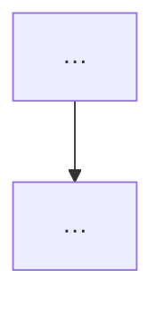

# 피쳐 README 규약

이 폴더 아래 각 피쳐(`Auth`·`Bill`·`Finance`·`Notification`·`Payee`·`Profile`)는
자기 폴더에 `README.md` 를 둔다. 이 문서는 **그 README 를 어떻게 쓰는가**와,
복사해서 시작할 **빈 템플릿**을 담는다.

## 원칙

피쳐 README 는 **지도지 진실이 아니다.** 루트 [CLAUDE.md](../../CLAUDE.md) 와 같은
철학이다 — 규칙화된 불변식은 [ARCHITECTURE.md](../../ARCHITECTURE.md), 시각 규칙은
[DESIGN.md](../../DESIGN.md) 에 있고, 피쳐 README 는 거기로 **라우팅**한다.

그래서 세 가지를 지킨다.

1. **중복하지 않는다.** ARCHITECTURE·DESIGN 에 있는 규칙을 옮겨 적지 말고 링크한다.
   양쪽이 갈리면 어느 게 진실인지 알 수 없어진다.
2. **필수는 작게.** 파일 두 개짜리 피쳐도 부담 없이 채울 수 있어야 한다. 나머지
   섹션은 그 피쳐가 값을 할 때만 붙인다.
3. **담고 싶은 건 "왜 이렇게 짰나".** 파일 목록은 코드를 보면 알지만, 설계 근거와
   "버그처럼 보이지만 의도된 것"은 문서가 아니면 사라진다.

## 섹션

### 필수 — 어떤 피쳐든 이건 채운다

| 섹션 | 내용 |
| --- | --- |
| `# 피쳐이름 (Folder)` + 한 줄 | 이 피쳐가 무엇을 하는가 |
| 라우팅 블록 | 규칙 → `DESIGN.md`, 불변식 → `ARCHITECTURE.md`, (하위 폴더면) 부모 README |
| `## 파일 지도` | 표 `파일 \| 하는 일`. 폴더가 여럿이면 폴더별로 나눈다 |

### 선택 — 그 피쳐가 값을 할 때만

| 섹션 | 언제 붙이나 |
| --- | --- |
| `## 용어` | 그 피쳐 특유의 낱말이 있을 때 (Finance 의 항목·적요·거래처럼) |
| `## 흐름` (mermaid) | 데이터·화면 흐름이 글로는 안 잡힐 때 |
| `## 핵심 모델 / 설계 결정` | "왜 이렇게 짰나"가 코드만 봐선 안 보일 때 |
| `## 되돌리지 말 것` | 버그처럼 보이지만 의도된 것. 근거는 `ARCHITECTURE.md` 로 링크 |
| `## 현재 상태 / 미결` | 진행 중이거나 남은 일이 있을 때 |

**용어는 위 이름을 그대로 쓴다.** `파일 지도`·`흐름`·`되돌리지 말 것`·`현재 상태 /
미결` — 새 낱말을 만들지 않는다. 통일감이 곧 이 규약의 목적이다.

## 규모별로 이렇게 접힌다

- **작은 피쳐**(`Auth`·`Notification`) — 제목 + 라우팅 + 파일 지도. 그걸로 끝.
- **중간**(`Bill`·`Payee`·`Profile`) — 거기에 흐름이나 설계 결정 한 섹션.
- **큰 피쳐**(`Finance`) — 필요한 선택 섹션을 다 쓰고, 하위 폴더는 자기 README 를
  갖는다(예: [Finance/Import/README.md](Finance/Import/README.md)). 이때 부모
  README 는 상세를 하위로 **보내는 포인터**만 남긴다.

살아 있는 예가 둘 있다 — 큰 피쳐는 [Finance/README.md](Finance/README.md),
하위 폴더는 [Finance/Import/README.md](Finance/Import/README.md).

## 빈 템플릿

새 피쳐를 만들면 아래를 복사해 그 폴더의 `README.md` 로 시작한다. 필수만 남기고
선택 섹션은 필요할 때 되살린다.

````markdown
# 피쳐이름 (Folder)

<이 피쳐가 무엇을 하는가 — 한 줄.>

- 규칙(시각)은 [DESIGN.md](../../../DESIGN.md) 에.
- 규칙화된 불변식은 [ARCHITECTURE.md](../../../ARCHITECTURE.md) 에.
<!-- 하위 폴더면: 기본 용어·전체 그림은 [../README.md](../README.md) 에. -->

## 파일 지도

| 파일 | 하는 일 |
| --- | --- |
| `A.swift` | … |
| `B.swift` | … |

<!-- 아래는 선택. 그 피쳐가 값을 할 때만 남긴다. -->

<!--
## 용어
- 낱말 : 뜻.

## 흐름


## 핵심 모델 / 설계 결정
왜 이렇게 짰나. 코드만 봐선 안 보이는 근거.

## 되돌리지 말 것
- 버그처럼 보이지만 의도된 것. 근거는 [ARCHITECTURE.md](../../../ARCHITECTURE.md) 에.

## 현재 상태 / 미결
- 진행 중이거나 남은 일.
-->
````

> 링크의 `../` 깊이는 파일 위치에 맞춘다. `Features/피쳐/README.md` 는 루트 문서까지
> `../../../` 다(위 템플릿 기준). 하위 폴더(`Features/피쳐/하위/README.md`)면 한 단계
> 더 들어가 `../../../../` 가 된다.

## 새 피쳐를 추가할 때

1. 위 템플릿을 그 폴더 `README.md` 로 복사하고 필수 세 가지를 채운다.
2. 피쳐가 커지면 선택 섹션을 되살린다. 하위 폴더가 생기면 그 폴더에 자기 README 를
   두고, 부모는 포인터만 남긴다.
3. 루트 [CLAUDE.md](../../CLAUDE.md) 의 "무엇을 언제 읽나" 표에 필요하면 한 줄 건다 —
   라우터가 그 피쳐로 가는 길을 알게.
