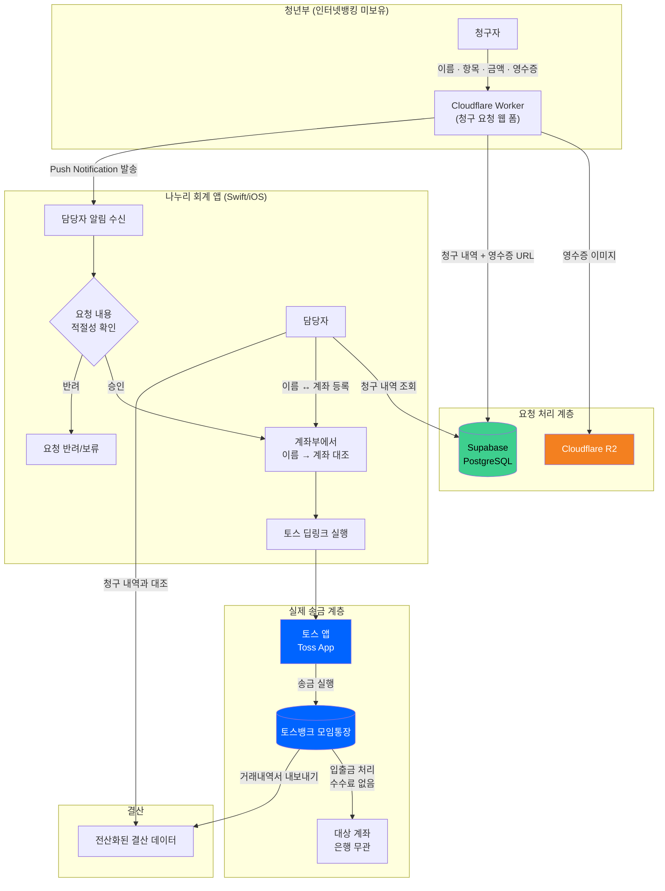
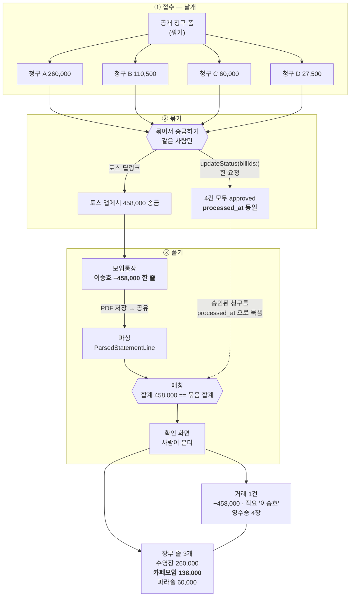

# 나누리 회계

교회 청년부의 **청구 → 송금 → 거래 확인 → 장부 기록** 과정을 하나로 잇고,
반복되는 회계 작업을 반자동화하는 회계 관리 시스템이다.

<p align="center">
  
  
</p>

## 배경

교회 청년부 계좌는 인터넷 뱅킹을 만들지 않았기 때문에, 현금 인출과 송금을 하려면
농협 ATM 을 매번 직접 찾아가야 했다. 게다가 송금이 끝난 뒤에는 실제 은행 거래
내역과 청구 내역을 다시 대조해 장부에 옮겨 적어야 했다.

정리하면 이런 문제가 있었다.

- 송금을 하려면 ATM 을 직접 방문해야 함
- 여러 청구 요청을 실제 송금 내역과 손으로 대조해야 함
- 하나의 송금에 여러 청구가 섞일 수 있어 청구와 거래의 관계를 추적하기 어려움
- 거래 내역을 장부에 다시 입력해야 함

나누리는 **토스뱅크 모임통장을 중간 송금 플랫폼으로 두고, 청구 데이터와 실제 거래
데이터를 연결해 회계 처리를 반자동화**하는 것을 목표로 한다.

## 해결 방안

- 중간 플랫폼으로 토스뱅크 모임통장을 두고, 여기서 송금과 입금을 처리한다.
- 송금 요청 폼을 작성할 수 있는 웹페이지를 두고, 요청이 오면 나누리 회계 앱으로 푸시 알림을 쏜다.
- 나누리 회계 앱에서 요청을 확인하고 적절한 요청이면 토스 딥링크로 송금한다.
- 모임통장 거래내역서를 앱으로 내보내면, 그 내역을 청구 내역과 대조해 장부에 입력한다.

## 왜 토스뱅크인가

- 어떤 은행권이든 입출금이 되고, 수수료가 없다.
- 송금 처리가 간편하고 빠르다.
- 거래내역서 내보내기를 제공해서, 결산 때 데이터 전산화에 유리하다.

## 계좌는 청구자에게 받지 않는다

청구 폼이 받는 값은 **이름 · 항목 · 금액 · 영수증** 네 가지뿐이다. 은행과 계좌번호는
묻지 않는다. 대신 관리자가 앱의 **계좌부**에 이름↔계좌를 한 번 등록해 두고, 접수된
이름을 그걸로 대조해 송금한다.

계좌를 폼에서 받으면 청구자가 매번 계좌번호를 적어야 하고, 한 자리만 틀려도 엉뚱한
곳으로 돈이 나간다. 청구하는 사람이 많지 않으니, 계좌는 **매번 받을 값이 아니라
관리자가 한 번 갖고 있을 값**이라고 봤다.

## 핵심 기능

### 청구서 관리

청구자가 제출한 청구를 확인하고 송금 여부를 관리한다.

- 청구 내역 조회
- 청구자 / 항목 / 금액 / 영수증 확인
- 청구 승인 및 반려
- 같은 사람의 청구 여러 건을 하나의 송금으로 묶기

### 송금

승인된 청구를 실제 송금으로 잇는다.

- 청구자 이름으로 등록된 계좌 조회
- 같은 수취인의 청구 금액 합산
- 토스 딥링크로 송금 실행
- 송금과 청구 승인 상태 동기화

### 계좌부

청구자의 이름과 실제 송금 계좌를 관리한다. 계좌부에 없는 이름이면 청구서 목록에
"계좌 미등록"으로 뜨고, 누르면 그 이름이 채워진 등록 시트가 바로 열린다.

### 재정 관리

토스 거래내역서와 청구 데이터를 연결해 장부를 관리한다.

- 거래내역서 가져오기
- 거래와 청구 내역 매칭
- 장부 항목 생성 및 거래별 분할
- 영수증 연결
- 통장별 잔액 및 재정 현황 확인

### 알림

새 청구가 접수되면 관리자에게 Push Notification 을 보낸다.

## 기술 스택

| 영역 | 기술 |
| --- | --- |
| 관리자 앱 | Swift / SwiftUI (iOS) |
| 인증 및 데이터베이스 | Supabase / PostgreSQL |
| 청구 폼 및 API | Cloudflare Worker |
| 영수증 저장 | Cloudflare R2 |
| 알림 | APNs |
| 송금 | Toss App Deep Link |

## 아키텍처 다이어그램



## 프로젝트 구조

하나의 iOS 앱만으로 끝나지 않는다. **청구를 받는 웹/서버 영역, 데이터를 저장하는
영역, 관리자가 쓰는 iOS 앱**이 하나의 시스템을 이룬다.

```text
nanuri-ios-app/
├── NanuriAdmin/
│   ├── App/
│   ├── Components/
│   └── Features/
│       ├── Auth/          — 인증
│       ├── Bill/          — 청구서 및 송금
│       ├── Finance/       — 재정 및 장부
│       ├── Notification/  — Push Notification
│       ├── Payee/         — 계좌부
│       └── Profile/       — 관리자 프로필
│
├── worker/               — Cloudflare Worker (공개 청구 폼 + 저장 + 푸시)
├── supabase/migrations/  — DB 스키마 이력
│
├── ARCHITECTURE.md
├── DESIGN.md
├── SETUP.md
├── TOSS.md
└── TROUBLESHOOTING.md
```

- **`NanuriAdmin/Features/`** — 사용자 기능을 기준으로 앱을 나눈다. 각 Feature 는
  자신에게 필요한 화면·모델·로직을 함께 갖는다.
- **`NanuriAdmin/Components/`** — 디자인 시스템, 원격 이미지, 영수증 저장처럼 여러
  Feature 가 공통으로 쓰는 것.
- **`worker/`** — 청구자가 제출한 데이터를 받아 Supabase 에 저장하고, 영수증을 R2 에
  올리고, 관리자 앱으로 푸시를 보낸다.
- **`supabase/migrations/`** — DB 구조 변경을 코드로 남긴다. 최신 것이 진실이고
  앞의 것은 이력이다.

## 주요 도메인

이 시스템에는 단계마다 **서로 다른 데이터 단위**가 있다. 이게 나누리를 이해하는 핵심이다.

```text
청구 단위      : Bill          청구자가 제출한 청구 1건
송금 단위      : BillGroup     같은 사람의 여러 청구를 묶은 송금 1건
은행 거래 단위 : Transaction   토스 거래내역서 한 줄 (은행이 증명한 사실)
장부 단위      : Finance Item  사람이 관리하는 장부 항목
```

- **Bill = 청구 단위, BillGroup = 송금 단위.** 같은 사람의 여러 청구는 따로 보내지
  않고 금액을 합쳐 한 번에 보낸다. 같은 승인 요청으로 처리된 Bill 은 같은
  `processed_at` 을 가져, 나중에 거래내역과 맞출 때 원래 송금 묶음을 복원한다.
- **Transaction = 은행 증명, Finance Item = 장부.** 거래는 거래내역서에서 파싱해
  만들고 편집하지 않는다. 항목은 사람의 판단이라 카테고리·적요·영수증·분할이 여기 산다.
  하나의 Transaction 은 여러 Finance Item 으로 나뉠 수 있다.

세 단위가 어긋나는 대표적인 경우가 **청구 4 → 송금 1 → 거래 1 → 장부 3** 이다.
아래 흐름이 그 예다.

## 청구 요청부터 장부 작성까지



**완전한 역연산은 아니다.** 청구 4건이 장부 3항목으로 돌아오는 건 같은 제목의 청구를
한 항목으로 합치기 때문이고(카페모임 110,500 + 27,500 = 138,000), 그 항목이 두 청구의
영수증을 함께 갖는다. 원본 청구 4건은 `bills` 에 그대로 남아 잃는 게 없다.

## 핵심 규칙 (요약)

자세한 근거와 불변식은 [ARCHITECTURE.md](./ARCHITECTURE.md) 에 있다. 여기서는 무엇을
지키는지만 짚는다.

- **같은 수취인의 청구만 묶는다.** 토스 딥링크는 수취인 한 명·금액 하나라, 사람이 다르면 못 묶는다.
- **금액이 1차 매칭 기준이다.** 시각은 후보를 거르는 창(window)과 순위에, 이름은 보조로 쓴다.
- **거래는 은행 증명, 항목은 장부다.** 거래는 파싱으로만 생기고 편집하지 않는다.
- **모든 거래는 최소 한 항목으로 완전히 풀린다.** 그래야 은행이 말한 금액과 장부 합계를 대조할 수 있다.
- **내부 이체는 실제 수입/지출과 구분한다.** 농협↔모임 자금 이동은 `is_internal_transfer`
  로 표시하고, 잔액에는 반영하되 합계·보고서에서는 제외한다.

## 관련 문서

프로젝트의 세부 구조와 설계는 아래 문서에서 관리한다.

- [ARCHITECTURE.md](./ARCHITECTURE.md) — 시스템 구조 및 핵심 불변식
- [DESIGN.md](./DESIGN.md) — UI 및 디자인 규칙
- [SETUP.md](./SETUP.md) — 개발 환경 설정
- [TOSS.md](./TOSS.md) — 참조한 토스 시각 언어 원문
- [TROUBLESHOOTING.md](./TROUBLESHOOTING.md) — 문제 해결 기록

Feature 별 상세는 각 Feature 의 README 를 참고한다.
