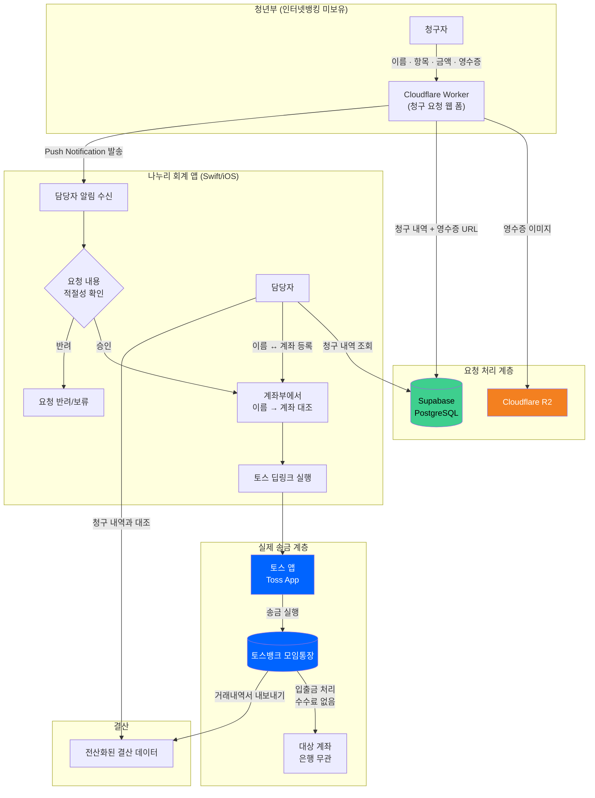

# 나누리 회계

  

## 배경

교회 청년부 계좌는 인터넷 뱅킹을 만들지 않았기 때문에, 현금 인출/송금 작업을 하기 위해 농협 ATM 기기를 매번 찾아가야 하는 번거로움이 있었다. 농협 ATM에 대한 의존도가 높고, 이로 인해 작업 처리가 지연된다는 문제점을 해결하기 위해, 송금 처리를 담당할 중간 플랫폼을 만들고자 한다.

## 해결 방안

- 중간 플랫폼으로 토스뱅크 모임통장을 두고, 여기서 송금 및 입금을 처리한다.
- 송금 요청 폼을 작성할 수 있는 웹페이지를 두고, 요청을 보내면 나누리 회계 앱으로 푸시 알림을 쏜다.
- 나누리 회계 앱에서 요청을 확인하고, 적절한 요청일 시, 토스 딥링크를 통해 송금 작업을 진행한다.

## 왜 토스뱅크인가

- 어떤 은행권이든 입출금이 가능하며, 수수료가 발생하지 않는다.
- 송금 처리가 간편하고 빠르다.
- 거래내역서 내보내기 기능을 제공하기에 결산 시, 데이터 전산화에 유리하다.

## 계좌는 청구자에게 받지 않는다

청구 폼이 받는 값은 **이름 · 항목 · 금액 · 영수증** 네 가지뿐이다. 은행과 계좌번호는
묻지 않는다. 대신 담당자가 앱의 **계좌부**에 이름↔계좌를 한 번 등록해 두고, 접수된
이름을 그걸로 대조해서 송금한다.

계좌를 폼에서 받으면 청구자가 매번 계좌번호를 적어야 하고, 한 자리만 틀려도 엉뚱한
곳으로 돈이 나간다. 보내는 사람은 늘 같은 소수이므로, 계좌는 **받을 게 아니라 갖고
있을 값**이라고 봤다. 앱에 계좌부 탭이 따로 있는 이유다.

## 기술 스택

| 영역 | 기술 |
|---|---|
| 청구 내역 저장 | Supabase (PostgreSQL) |
| 청구 내역 작성/제출, 영수증 이미지 저장 | Cloudflare Worker / R2 |
| 청구 내역 확인 | Swift (iOS) |
| 실제 송금 작업 수행 | Toss App (딥링크) |

## 아키텍처 다이어그램

## 핵심 흐름 요약

1. 청구자가 웹 폼에서 송금 요청 → Worker가 영수증을 R2에 올리고 청구 내역 + 영수증 URL을 Supabase에 저장
2. Supabase 저장과 동시에 나누리 앱(Swift)으로 Push 알림
3. 담당자가 앱에서 요청 확인 후 승인 → 계좌부에서 이름으로 계좌를 찾아 토스 딥링크 실행
4. 토스뱅크 모임통장에서 실제 송금/입금 처리 (은행 무관, 무수수료)
5. 결산 시 토스 거래내역서 + Supabase 청구 데이터를 대조해 전산화
