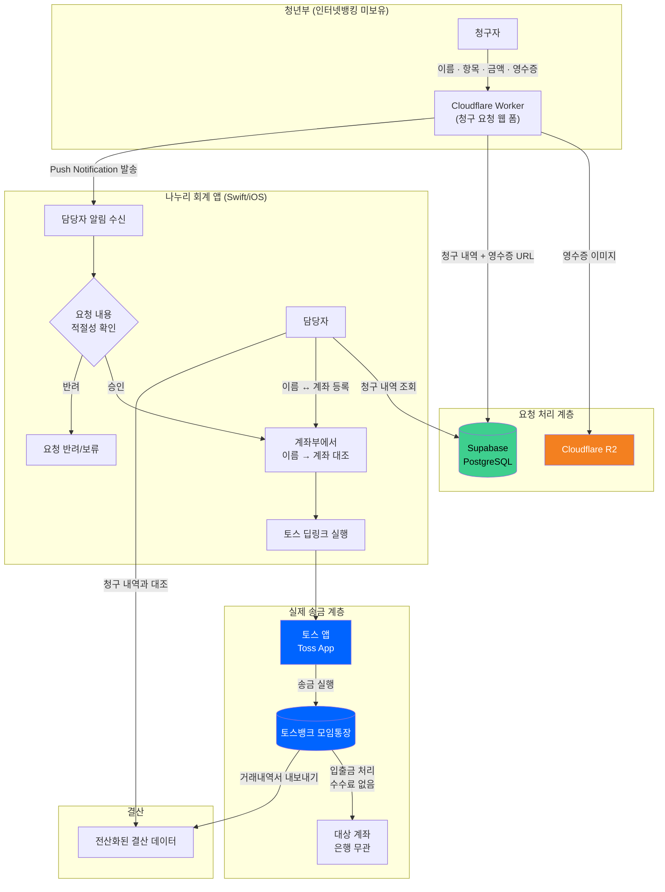
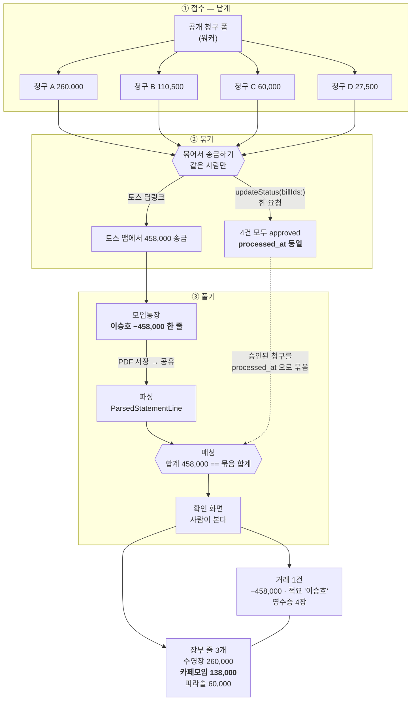

# 나누리 회계

교회 청년부의 **청구 → 송금 → 거래 확인 → 장부 기록** 과정을 하나로 잇고,
반복되는 회계 작업을 반자동화하는 iOS 회계 관리 시스템이다.

<p align="center">
  
  
</p>

## 해결하려는 문제

교회 청년부 계좌는 인터넷 뱅킹을 만들지 않아, 현금 인출과 송금을 하려면 농협 ATM 을
매번 직접 찾아가야 했다. 게다가 송금이 끝난 뒤에는 실제 은행 거래 내역과 청구 내역을
다시 대조해 장부에 옮겨 적어야 했다.

- 송금을 하려면 ATM 을 직접 방문해야 함
- 여러 청구를 실제 송금 내역과 손으로 대조해야 함
- 하나의 송금에 여러 청구가 섞여, 청구와 거래의 관계를 추적하기 어려움
- 거래 내역을 장부에 다시 입력해야 함

나누리는 **토스뱅크 모임통장을 중간 송금 플랫폼으로 두고, 청구 데이터와 실제 거래
데이터를 연결해 회계 처리를 반자동화**하는 것을 목표로 한다. 왜 이렇게 설계했는지는
[ARCHITECTURE.md](./ARCHITECTURE.md) 에 있다.

## 핵심 기능

### 청구서 관리

청구자가 제출한 청구를 확인하고 송금 여부를 관리한다.

- 청구 내역 조회
- 청구자 / 항목 / 금액 / 영수증 확인
- 청구 승인 및 반려
- 같은 사람의 청구 여러 건을 하나의 송금으로 묶기

### 송금

승인된 청구를 실제 송금으로 잇는다.

- 청구자 이름으로 등록된 계좌 조회
- 같은 수취인의 청구 금액 합산
- 토스 딥링크로 송금 실행
- 송금과 청구 승인 상태 동기화

### 계좌부

청구자의 이름과 실제 송금 계좌를 관리한다. 청구 폼은 계좌번호를 받지 않고, 관리자가
계좌부에 이름↔계좌를 미리 등록해 두고 접수된 이름으로 대조한다. 계좌부에 없는 이름이면
청구서 목록에 "계좌 미등록"으로 뜨고, 누르면 그 이름이 채워진 등록 시트가 바로 열린다.

### 재정 관리

토스 거래내역서와 청구 데이터를 연결해 장부를 관리한다.

- 거래내역서 가져오기
- 거래와 청구 내역 매칭
- 장부 항목 생성 및 거래별 분할
- 영수증 연결
- 통장별 잔액 및 재정 현황 확인

### 알림

새 청구가 접수되면 관리자에게 Push Notification 을 보낸다.

## 전체 동작 흐름

청구 접수부터 결산까지 시스템 전체가 어떻게 맞물리는지를 보여준다.



청구 여러 건이 하나의 송금으로 묶였다가, 통장에 한 줄로 찍힌 거래를 다시 장부 여러
항목으로 되푸는 과정은 아래와 같다. 단계마다 데이터 단위가 다르다는 점이 핵심이다
(매칭 규칙과 도메인 정의는 [ARCHITECTURE.md](./ARCHITECTURE.md)).



## 프로젝트 구조

하나의 iOS 앱만으로 끝나지 않는다. **청구를 받는 웹/서버 영역, 데이터를 저장하는
영역, 관리자가 쓰는 iOS 앱**이 하나의 시스템을 이룬다.

```text
nanuri-ios-app/
├── NanuriAdmin/
│   ├── App/
│   ├── Components/
│   └── Features/
│       ├── Auth/          — 인증
│       ├── Bill/          — 청구서 및 송금
│       ├── Finance/       — 재정 및 장부
│       ├── Notification/  — Push Notification
│       ├── Payee/         — 계좌부
│       └── Profile/       — 관리자 프로필
│
├── worker/               — Cloudflare Worker (공개 청구 폼 + 저장 + 푸시)
├── supabase/migrations/  — DB 스키마 이력
│
├── ARCHITECTURE.md
├── DESIGN.md
├── SETUP.md
├── TOSS.md
└── TROUBLESHOOTING.md
```

- **`NanuriAdmin/Features/`** — 사용자 기능을 기준으로 앱을 나눈다. 각 Feature 는
  자신에게 필요한 화면·모델·로직을 함께 갖는다.
- **`NanuriAdmin/Components/`** — 디자인 시스템, 원격 이미지, 영수증 저장처럼 여러
  Feature 가 공통으로 쓰는 것.
- **`worker/`** — 청구자가 제출한 데이터를 받아 Supabase 에 저장하고, 영수증을 R2 에
  올리고, 관리자 앱으로 푸시를 보낸다.
- **`supabase/migrations/`** — DB 구조 변경을 코드로 남긴다. 최신 것이 진실이고
  앞의 것은 이력이다.

## 기술 스택

| 영역 | 기술 |
| --- | --- |
| 관리자 앱 | Swift / SwiftUI (iOS) |
| 인증 및 데이터베이스 | Supabase / PostgreSQL |
| 청구 폼 및 API | Cloudflare Worker |
| 영수증 저장 | Cloudflare R2 |
| 알림 | APNs |
| 송금 | Toss App Deep Link |

## 관련 문서

프로젝트의 세부 구조와 설계는 아래 문서에서 관리한다.

- [ARCHITECTURE.md](./ARCHITECTURE.md) — 시스템 구조, 도메인, 핵심 불변식, 설계 근거
- [DESIGN.md](./DESIGN.md) — UI 및 디자인 규칙
- [SETUP.md](./SETUP.md) — 개발 환경 설정
- [TOSS.md](./TOSS.md) — 참조한 토스 시각 언어 원문
- [TROUBLESHOOTING.md](./TROUBLESHOOTING.md) — 문제 해결 기록

Feature 별 상세는 각 Feature 의 README 를 참고한다.
